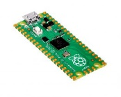
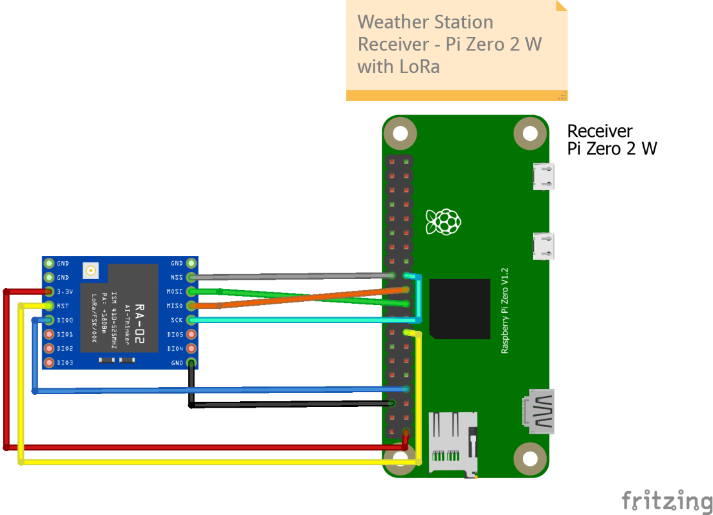
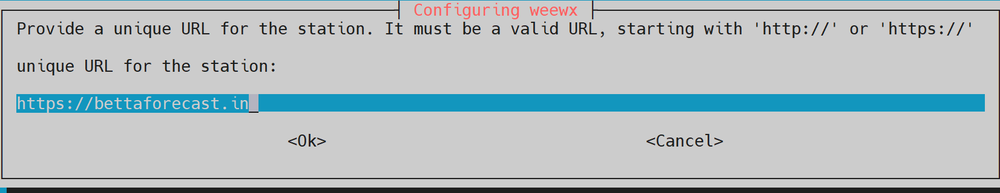

# 📝 Project Overview
This project provides a comprehensive guide to building a personalized, wireless weather station using a **Raspberry Pi Pico W** and a **Raspberry Pi Zero 2 W**.

**The guide details both the hardware setup and the software configuration necessary to collect, store, and display real-time weather data.**

The guide details the necessary hardware and software, including connections for sensors measuring **temperature, humidity, barometric pressure, wind speed and direction, and rainfall**. It explains how to set up the Raspberry Pi Pico W as a data sender and the Raspberry Pi Zero 2 W as a receiver using [**LoRa**](https://en.wikipedia.org/wiki/LoRa) to wirelessly send/receive data. [**Weewx**](https://weewx.com/) then processes, stores and displays the data. The guide also includes optional steps for advanced features such as setting up a virtual private server to publish real-time weather data online, configuring an Android app for remote monitoring, and backing up the system.

This project is inspired by [**Raspberry Pi's Personal Weather Station**](https://projects.raspberrypi.org/en/projects/build-your-own-weather-station/0)


# 📃 Wireless Weather Station v1 - A Technical Briefing

This section summarizes the document, outlining the project's **goals, architecture, and implementation.**

**Project Goals**

This project aims to build a low-cost (~ ₹12,000), personalized wireless weather station using off-the-shelf components and open-source software. The station will collect and display the following data:

-   Temperature
-   Humidity
-   Barometric Pressure
-   Wind Speed
-   Wind Direction
-   Rainfall
-   Dew Point

A key goal is integrating the collected data with advanced AI models like Google DeepMind's GraphCast or Microsoft's FarmVibes.AI for localized weather forecasting. This addresses a crucial need for farmers requiring accurate, location-specific predictions to make informed decisions about their crops.

**Architecture**

-   **Hardware:** The system uses a Raspberry Pi Pico to collect data from various sensors (BME280, Wind Vane, Anemometer, Rain Gauge). The Pico transmits this data wirelessly via LoRa to a Raspberry Pi Zero 2 W acting as the receiver and data processor.

-   **Software:**

    o **MicroPython:** Powers the sensor data collection and LoRa transmission on the Raspberry Pi Pico.
    
    o **Raspberry Pi OS:** Runs on Raspberry Pi Zero 2W

    o **Python:** Programming language for the code
    
    o **WeeWX:** Open-source weather software running on the Pi Zero 2 W, responsible for data storage, processing, and generating reports.
    
    o **Apache Web Server:** Hosts the Weewx reports on a remote VPS (Virtual Private Server), making the data accessible online.
    
    o **Rsync:** Used for secure and efficient data transfer from the Pi Zero 2 W to the VPS.
    
    o **Let's Encrypt (Certbot):** Secures the website with a free SSL certificate.
    
    o **MQTT:** Enables real-time data streaming from the Pi Zero 2 W to the webserver.
    
    o **Optional Components:Android App:** Leverages the Inigo extension for Weewx to display real-time data on Android devices.
    
    o **Belchertown Skin:** Provides a customizable and feature-rich interface for the web-based weather data.
    
    o **Windy.com Uploader:** Allows data sharing with the Windy.com platform.

**Implementation Highlights**

-   **Data Collection Frequency:** The Pico transmits data every 5 seconds for power conservation. This is configurable.

-   **Security:** The VPS uses SSH key pairs for passwordless login.

     - MQTT employs username and password authentication for publishing data.

     - The website is secured with an SSL certificate from Let's Encrypt.

-   **Data Accessibility:** Data is accessible on the local network via the Pi Zero 2 W's IP address.

     - Remote access and real-time updates are available through a custom domain (e.g., bettaforecast.in) hosted on the VPS.

-   **Backup:** Weekly backups of the entire system are performed on both the Pi Zero 2 W and the VPS.

**Challenges and Solutions**

-   **Running Weewx as a non-root user:** I encountered issues running Weewx as a non-root user despite its support. The solution was to run it as root, which needs further investigation for security reasons.
-   **MQTT compatibility with Firefox:** A known issue with Firefox's SSL connection to MQTT servers over HTTP/2 was resolved by instructing users to disable HTTP/2 for WebSockets in Firefox's configuration settings.

**Future Enhancements**

The document suggests several future enhancements for the project, including:

-   Solar-powered transmitter for off-grid operation
-   Integrating sensors for Air Quality Index, UV Index, Light Intensity, and Soil Moisture
-   Exploring alternative, potentially more affordable, options for the wind/rain sensor package

**Conclusion**

This document provides a detailed guide for building a customized, low-cost wireless weather station. The project combines readily available components with powerful open-source software to deliver real-time, location-specific weather data, ultimately enabling informed decision-making in agriculture and beyond.
 
## Table of Contents

* [📝 Project Overview](#-project-overview)
* [📃 Wireless Weather Station v1 - A Technical Briefing](#-wireless-weather-station-v1---a-technical-briefing)
* [📝Document Control](#document-control)
* [📇 Introduction](#-introduction)
  + [🔭Images](#images)
  + [💫Project Outline](#project-outline)
  + [🧑‍🏭Architecture](#architecture)
  + [🤔Future Enhancements](#future-enhancements)
  + [✏️Data Accessibility](#data-accessibility)
  + [🎯Motivation](#motivation)
  + [🧪Implementation](#implementation)
    - [💻Hardware Setup](#hardware-setup)
    - [🔳Software Setup](#software-setup)
  + [💻 Hardware Used](#-hardware-used)
  + [🔳 Softwares](#-softwares)
  + [🔗References And Credits](#references-and-credits)
* [🤖 Setup the Raspberry Pi](#-setup-the-raspberry-pi)
  + [💿Flashing the Image](#flashing-the-image)
  + [🖥️ Configure the OS](#-configure-the-os)
    - [🔳 Check for Updates](#-check-for-updates)
    - [🔑Setup Private/Public Key for passwordless login (Optional)](#setup-privatepublic-key-for-passwordless-login-optional)
    - [🛠️Configure the Pi to enable certain options](#configure-the-pi-to-enable-certain-options)
    - [🛠️Install Pip](#install-pip)
* [🤖 Setup the Raspberry Pi Pico](#-setup-the-raspberry-pi-pico)
  + [💿Flashing the Image](#flashing-the-image-1)
* [🌡️ Setup the Weather Station](#-setup-the-weather-station)
  + [🎐 Setup the Weather Meter](#-setup-the-weather-meter)
  + [🎐 Connect the sensors and LoRa to Pico - Sender](#-connect-the-sensors-and-lora-to-pico---sender)
  + [🎐 Connect LoRa to Pi - Receiver](#-connect-lora-to-pi---receiver)
  + [🔳 Setup the software code (Program)](#-setup-the-software-code-program)
    - [🛠️Pico](#pico)
  + [🖥️Install Weewx](#install-weewx)
    - [👩‍🔧Raspberry Pi driver for Weewx](#raspberry-pi-driver-for-weewx)
  + [👩‍🔧CUSTOMIZATION](#customization)
* [🖥️Setup the Virtual Private Server (VPS) (Optional)](#setup-the-virtual-private-server-vps-optional)
  + [🕸️ Setup The VPS Server to act as Webserver](#-setup-the-vps-server-to-act-as-webserver)
    - [🧑Create Username](#create-username)
    - [🔳 Change the default shell of weex to bash](#-change-the-default-shell-of-weex-to-bash)
    - [🔳 CHANGE SHELL COLOR FOR WEEWX TO GREEN](#-change-shell-color-for-weewx-to-green)
    - [🔳 CHANGE SHELL COLOR FOR ROOT TO RED](#-change-shell-color-for-root-to-red)
    - [🔑 SETUP KEYPAIR FOR WEEWX TO LOGIN WITHOUT A PASSWORD.](#_Toc169602836)
    - [🦾Add weewx to sudo](#add-weewx-to-sudo)
  + [🕸️Install Apache Web Server](#_Toc169602838)
    - [🕸️Step 1 — Installing Apache](#step-1--installing-apache)
    - [🧱Step 2 — Adjusting the Firewall](#step-2--adjusting-the-firewall)
    - [🖥️Step 3 — Checking your Web Server](#step-3--checking-your-web-server)
    - [👨‍💼Step 4 — Managing the Apache Process](#step-4--managing-the-apache-process)
    - [💻Setup the domain name to point to the server](#setup-the-domain-name-to-point-to-the-server)
    - [🖥️Step 5 — Setting Up Virtual Hosts (Recommended)](#step-5--setting-up-virtual-hosts-recommended)
    - [🗃️Step 6 – Getting Familiar with Important Apache Files and Directories](#step-6--getting-familiar-with-important-apache-files-and-directories)
  + [💭 Setup the weather station to display data to the internet](#-setup-the-weather-station-to-display-data-to-the-internet)
  + [🔁Setup Rsync from Weewx to Webserver](#setup-rsync-from-weewx-to-webserver)
    - [🔐Setup passwordless SSH](#setup-passwordless-ssh)
    - [🔛ENABLE RSYNC](#enable-rsync)
  + [🔐Add SSL to the webserver](#add-ssl-to-the-webserver)
    - [❗Prerequisite](#prerequisite)
    - [🎖️Step 1 — Installing Certbot](#_Toc169602852)
    - [🖥️Step 2 — Checking your Apache Virtual Host Configuration](#step-2--checking-your-apache-virtual-host-configuration)
    - [🔐Step 4 — Obtaining an SSL Certificate](#step-4--obtaining-an-ssl-certificate)
    - [🎖️Step 5 — Verifying Certbot Auto-Renewal](#step-5--verifying-certbot-auto-renewal)
* [📱Setup Android App (Optional)](#setup-android-app-optional)
  + [➕Step 1, install the Inigo extension for weeWX.](#step-1-install-the-inigo-extension-for-weewx)
  + [🌝Step 2, Almanac (optional)](#step-2-almanac-optional)
  + [🔂Step 3, Restarting weeWX](#step-3-restarting-weewx)
  + [📃Step 4, create inigo-settings.txt](#step-4-create-inigo-settingstxt)
  + [☔Step 5, using offset rain times (optional)](#step-5-using-offset-rain-times-optional)
  + [📱Step 6, installing the app](#step-6-installing-the-app)
* [🧘‍♂️Setup Belchertown Skin](#setup-belchertown-skin)
  + [🌧️AerisWeather Forecast API (optional)](#aerisweather-forecast-api-optional)
  + [📃Install Weewx-Belchertown Skin](#install-weewx-belchertown-skin)
  + [💿 Setup SMB Server on the Raspberry Pi](#-setup-smb-server-on-the-raspberry-pi)
  + [🪈 MQTT and MQTT Websockets (optional)](#-mqtt-and-mqtt-websockets-optional)
  + [Windy (Optional)](#windy-optional)
* [🕸️ Sitemap (Optional)](#-sitemap-optional)
* [📑 Backup](#-backup)
* [🤔WIRELESS WEATHER STATION FAQ](#wireless-weather-station-faq)
* [❗ Issues and Fixes](#-issues-and-fixes)
  + [MQTT Won’t work on Firefox](#mqtt-wont-work-on-firefox)

# 📝Document Control

| **Date**      | **Version** | **Change**                                                                 |
|---------------|-------------|----------------------------------------------------------------------------|
| June 16, 2024 | 1           | Initial build - The breadboard version that is used for a proof of concept |

# 🔭Images

Weather Station 


Mobile Site


Desktop Site


# 📇 Introduction

Links for this project:

[Working demo of weather station data being displayed in real-time](https://bettaforecast.in)

[vrishabkakade/wireless_weatherstation_v1: This repository contains all the code for the weather station (github.com)](https://github.com/vrishabkakade/wireless_weatherstation_v1)

[Instructables page](https://www.instructables.com/Wireless-Weather-Station-V1-Using-Raspberry-Pi-Pic/)

[This file](https://github.com/vrishabkakade/wireless_weatherstation_v1/blob/4c5b5e87e840d6e22a9daa0688d472a94a510e90/Wireless%20Weather%20Station%20Build%20v1.pdf)

## 💫Project Outline

This project aims to construct a wireless personalized weather station capable of measuring various atmospheric and environmental parameters. The station will monitor and display the following:

1.  Temperature
2.  Humidity
3.  Barometric Pressure
4.  Wind Speed
5.  Wind Direction
6.  Rainfall
7.  Dew Point

The project is inspired by the Raspberry Pi Foundation's “[Build your own weather station](https://projects.raspberrypi.org/en/projects/build-your-own-weather-station/0)”. However, **this project will make the sender wireless and integrate the sender and receiver hardware with** [**WeeWX: open source weather software**](https://weewx.com/)**.**

I have previously deployed the Raspberry Pi's weather station following their instructions and the live real-time data can be viewed at [Betta Forecast](https://bettaforecast.in/). I have also integrated RPi weather station with Weewx.

**Version 1 of the wireless weather station is a proof of concept that will be executed on a breadboard and indoors. This project aims to understand how the architecture works before going to more complex prototype builds.**

Subsequent versions will build a prototype that will be deployed on the field.

This project has the potential to provide valuable insights into local weather conditions and environmental factors. It can be used for various applications such as personal weather forecasting, gardening, and scientific research. By making the sender wireless, the station can be placed in remote locations or areas with difficult access to power outlets. The integration with WeeWX allows for easy data storage, visualization, and sharing.

To ensure the success of this project, careful planning and execution are necessary. This includes selecting the appropriate sensors, designing the wireless communication system, and integrating the hardware with WeeWX. The project also involves data analysis and visualization to make the weather data meaningful and accessible.

Overall, this project is an exciting opportunity to create a customized weather station that meets specific needs and preferences. It combines hardware, software, and data analysis to provide a comprehensive understanding of local weather conditions.

The data gathered from the deployed sensors can be utilized in various ways. One exciting application is feeding the data into advanced AI models like [Google DeepMind's GraphCast](https://github.com/google-deepmind/graphcast). GraphCast is a powerful AI system that can perform graph-based forecasting. By leveraging GraphCast, we can generate accurate and granular forecasts of local weather conditions. This has the potential to revolutionize weather forecasting, providing real-time and hyper-local predictions that can be tailored to specific geographic areas.

Other potential open-source application that can use this data is [Microsoft's FarmVibes.AI: Multi-Modal GeoSpatial ML Models for Agriculture and Sustainability](https://github.com/microsoft/farmvibes-ai)

The integration of sensor data with AI models like GraphCast opens up a wide range of possibilities. Here are some examples of how this combination can enhance weather forecasting:

1.  **Improved Accuracy:** By incorporating real-time sensor data, AI models can learn from the latest observations and make more accurate predictions. This can help mitigate the limitations of traditional weather forecasting models, which often rely on historical data and may not capture sudden changes in weather patterns.
2.  **Granular Forecasting:** The combination of sensor data and AI enables the generation of highly granular forecasts. Instead of relying on broad regional forecasts, users can access localized predictions for specific neighborhoods or even streets. This level of detail is particularly valuable for applications such as agriculture, transportation, and disaster management.
3.  **Real-Time Monitoring:** With the continuous flow of data from the sensors, AI models can perform real-time monitoring of weather conditions. This allows for the detection of rapidly changing weather patterns, such as thunderstorms or sudden wind shifts, providing timely alerts and warnings to affected communities.
4.  **Climate Analysis:** The long-term collection of sensor data can be used for climate analysis. By studying the historical data, scientists and researchers can gain insights into climate patterns, identify trends, and assess the impact of climate change on local weather conditions.
5.  **Smart City Applications:** In smart cities, real-time weather data can be integrated with urban infrastructure to improve traffic management, energy efficiency, and public safety. For example, data from weather sensors can be used to adjust traffic signals in response to changing weather conditions, reducing congestion and improving overall mobility.

By leveraging the power of open-source and advanced AI models, this project has the potential to transform weather forecasting, offering more accurate, granular, and timely predictions that can benefit individuals, communities, and organizations worldwide.

## 🧑‍🏭Architecture


## 🤔Future Enhancements

1.  Solar powered transmitter
2.  Air Quality Index
3.  UV Index
4.  Light Intensity
5.  Soil Moisture

## ✏️Data Accessibility

The system will publish real-time weather data to one or many websites, allowing remote monitoring of current weather conditions.

## 🎯Motivation

Accurate weather forecasting is crucial, particularly for farmers who rely on timely information for agricultural decision-making. Existing forecasts often cover broad regions and may not accurately reflect local conditions. By gathering localized weather data, farmers can make informed decisions regarding crop protection, fertilization, and irrigation.

## 🧪Implementation

### 💻Hardware Setup
The BME280, Wind Vane, Anemometer, Rain Gauge and LoRa transmitter are connected to Raspberry Pi Pico. The Pico will transmit the data wirelessly to a LoRa-connected Raspberry Pi (in my case I use Pi Zero 2 W, but any version of Pi can be used) which will act as a receiver and process the data received.

### 🔳Software Setup
Data storage will be managed using the Weewx platform, while data visualisation will be achieved through customisable skins.

As for the weather predictions goes – the most important is the rainfall data. Ideally, I should be able to pass the captured data to Google’s Graphcast or any other AI and get a weather forecast for my specific location. The problem with weather forecasts today is that it is given for a much wider region and they might not necessarily apply to our location. For example, in the coffee estates, it would have rained a few kilometres away, but not in that estate. More accurate weather predictions for a particular region will be able to help farmers determine things like when to spray their plants, manure them and irrigate them. Regarding weather forecasts, the rainfall data is of utmost importance. Ideally, the captured data should be compatible with AI platforms like Google's Graphcast, enabling us to obtain weather forecasts specific to our location. The current challenge with weather forecasts is that they are often provided for broader regions, which may not accurately represent local conditions. In agricultural settings, for instance, rainfall can vary significantly within a few kilometers, impacting farming activities such as spraying plants, applying manure, and irrigation. Accurate and localized weather predictions for a particular region can assist farmers in making informed decisions about their crops.

## 💻 Hardware Used

I have used the below components to build the weather station

| **Sl No** | **Image**                                                                                                         | **Part**                                                                                                                                                                                                                                                         | **Purpose**                                                                                       | **Qty** | **Cost** |
|-----------|-------------------------------------------------------------------------------------------------------------------|------------------------------------------------------------------------------------------------------------------------------------------------------------------------------------------------------------------------------------------------------------------|---------------------------------------------------------------------------------------------------|---------|----------|
| 1         |                                                                    | [Buy Raspberry Pi Zero 2 W Online at Robu.in](https://robu.in/product/raspberry-pi-zero-2-w/)                                                                                                                                                                    | Receives data wirelessly and runs the software                                                    | 1       | ₹ 1,649  |
| 2         |                                                  | [Raspberry Pi Pico W (robu.in)](https://robu.in/product/raspberry-pi-pico-w/)                                                                                                                                                                                    | Connect the sensors and send data. Non-Wi-Fi variant of Pico will also work as we don’t use Wi-Fi | 1       | ₹ 539    |
| 3         |                                                                    | [Buy 2.54MM pitch 40 Pin Male Double Row (2x20) Pin Header Strip Breakable-10pcs (robu.in)](https://robu.in/product/2-54mm-pitch-40-pin-male-double-row-2x20-pin-header-strip-breakable-2pcs/)                                                                   | For the Raspberry Pi GPIO pins                                                                    | 1       | ₹ 45     |
| 4         |                                                                    | [SX1278 LoRa Module Ra- 02 433MHZ Wireless Spread Spectrum Transmission – Robocraze](https://robocraze.com/products/sx1278-lora-module-ra-02-433mhz-wireless-spread-spectrum-transmission?_pos=1&_psq=lora&_ss=e&_v=1.0)                                         | To send and receive data                                                                          | 2       | ₹ 434    |
| 6         |                                                                   | [5V 3A ERD Power Adapter with Micro USB cable × 1](https://robocraze.com/products/5v-3a-erd-power-adapter?_pos=18&_sid=d1751e01c&_ss=r)                                                                                                                          | Power suppy for the Raspberry Pi                                                                  | 1       | ₹ 299    |
| 8         |                                                                    | [BME280 Temperature Sensor Module × 1](https://robocraze.com/products/bme280-temperature-sensor-module?_pos=1&_psq=bme280&_ss=e&_v=1.0)                                                                                                                          | Measures temperature, humidity and atmospheric pressure                                           | 1       | ₹ 409    |
|  9        |                                         | [Weather Meter Kit SparkFun](https://evelta.com/weather-meter-kit-sparkfun/)                                                                                                                                                                                     | To measure wind speed, wind direct and rainfall                                                   | 1       | ₹ 7,841  |
| 10        |                                                                   | [HASTHIP® Wire Crimping Tool Wire Cutter Ratchet Wire Crimper Set with 1550PCS Dupont Connectors Male/Female Pin 0.1-1.0mm² for 2.54/3.96mm KF2510 Connector 28-18AWG](https://www.amazon.in/gp/product/B0CJDVTLJ8/ref=ppx_od_dt_b_asin_title_s01?ie=UTF8&psc=1) | To connect wires to dupont conenctors                                                             | 1       | ₹ 1,899  |
| 11        |                                                                   | [SanDisk Ultra 64GB microSDXC UHS-I, 140MB/s R, Memory Card, 10 Y Warranty, for Smartphones](https://www.amazon.in/gp/product/B0BDRVFDKP/ref=ppx_od_dt_b_asin_title_s01?ie=UTF8&psc=1)                                                                           | Install Raspberry Pi OS                                                                           | 1       | ₹ 538    |
| 12        |  | [Buy 24 AWG Jumper Cable 150mm Red at the Best Price Online in India (robu.in)](https://robu.in/product/motherboard-breadboard-jumper-cable-150mm-24awg-red-50pcs/)                                                                                              | Prefer various colours to make connections to the breadboard                                      | 1       | ₹ 68     |
| 13        |                             | [Buy GL-12 840 Points Solderless Breadboard online at the best price in India\|Robu.in](https://robu.in/product/breadboard-840-tie-points-solderless-diy-project-circuit-test-breadboard/)                                                                       | To connect the Pico and sensors                                                                   | 1       | ₹ 49     |
| 14        |                                              | [Buy 50 CM Micro USB Cable Online at Robu.in](https://robu.in/product/50-cm-micro-usb-cable/)                                                                                                                                                                    | Power up the Pico and transfer files                                                              | 1       | ₹ 24     |
| 15        |                     | 4.7k Ohm 0.5W Metal Film Resistor (Pack of 50)                                                                                                                                                                                                                   | For the circuit. We will only need 1                                                              | 1       | ₹ 35     |
|  16       |          | [Plusivo Soldering Kit With Diagonal Wire Cutter × 1](https://robu.in/product/plusivo-soldering-kit-with-diagonal-wire-cutter/)                                                                                                                                  | To solder the sensors and parts to the board                                                      | 1       | ₹ 1,366  |

The total cost of the components excluding the Dupont and soldering kit is \~ ₹12,000.

The cost without the Sparkfun Wind/Rain which is the most expensive component is \~ ₹4,000.

One of the things to do will be to see how the cost of Sparkfun kit can be brought down.

## 🔳 Softwares

| **Software**                                             | **Version**                                                                                                                                                                                                                                                | **Used for**                                                                                                                                    |
|----------------------------------------------------------|------------------------------------------------------------------------------------------------------------------------------------------------------------------------------------------------------------------------------------------------------------|-------------------------------------------------------------------------------------------------------------------------------------------------|
| [Raspberry Pi OS](https://www.raspberrypi.com/software/) | [Raspberry Pi OS LiteRelease date: March 15th 2024System: 32-bitKernel version: 6.6Debian version: 12 (bookworm)](https://downloads.raspberrypi.com/raspios_lite_armhf/images/raspios_lite_armhf-2024-03-15/2024-03-15-raspios-bookworm-armhf-lite.img.xz) | I'm picking a non-desktop variant as I only need this to run the weather station and nothing else and the Zero 2 W hardware isn't very powerful |
| [WeeWX](https://weewx.com/docs/5.0/)                     | 5                                                                                                                                                                                                                                                          | Storing data and frontend data display                                                                                                          |
| [Apache](https://httpd.apache.org/)                      | 2.4                                                                                                                                                                                                                                                        | Web server to display the reports generated by WeeWX in a web browser                                                                           |

## 🔗References And Credits

| **Source**                                                                                                                                                                      | **Used For**                                                                                                                                     |
|---------------------------------------------------------------------------------------------------------------------------------------------------------------------------------|--------------------------------------------------------------------------------------------------------------------------------------------------|
| [Raspberry Pi Foundation - Build your own weather station](https://projects.raspberrypi.org/en/projects/build-your-own-weather-station/0)                                       | Tutorial to build the weather station hardware and base software                                                                                 |
| [Raspberry Pi Oracle Weather Station Python Code](https://github.com/RaspberryPiFoundation/weather-station)                                                                     | Starting point to write the code already written by Raspberry Pi Foundation                                                                      |
| [WeeWX](https://weewx.com/docs/5.0/)                                                                                                                                            | Storing data and frontend data display                                                                                                           |
| [WeeWX Wiki](https://github.com/weewx/weewx/wiki)                                                                                                                               | Good information about WeeWX - between their base doc and this all can be found                                                                  |
| [Install Apache](https://projects.raspberrypi.org/en/projects/lamp-web-server-with-wordpress/2)                                                                                 | Web server to display the reports generated by WeeWX in a web browser                                                                            |
| [WeeWX driver implementation of the Build Your Own Weather Station](https://github.com/jardiamj/BYOWS_RPi/tree/master)                                                          | Installation of the driver                                                                                                                       |
| [jardiamj/BYOWS_RPi: weeWX Driver for Build Your Own Weather Station for Raspberry Pi (github.com)](https://github.com/jardiamj/BYOWS_RPi)                                      | Our Weewx driver will be a modification of this                                                                                                  |
| [chandrawi/LoRaRF-Python: Python library for basic transmitting and receiving data using LoRa and FSK modem (github.com)](https://github.com/chandrawi/LoRaRF-Python/tree/main) | LoRa receiver code that runs on Raspberry Pi                                                                                                     |
| [martynwheeler/u-lora: raspi-lora for micropython (github.com)](https://github.com/martynwheeler/u-lora)                                                                        | LoRa sender code that runs on Pico                                                                                                               |
|                                                                                                                                                                                 |                                                                                                                                                  |
| Other's blogs on how to get WeeWX to work                                                                                                                                       |                                                                                                                                                  |
|                                                                                                                                                                                 |                                                                                                                                                  |
| [MATTHEW PIERCEY - MAKING A CUSTOM OFFLINE WEATHER STATION WITH WEEWX](https://overscore.media/posts/making-a-custom-offline-weather-station-with-weewx)                        | Excellent resource to give information about other resources                                                                                     |
| [Nev and Gays Home Weather](https://powersolarweather.duckdns.org:8046/weather/belchertown/about/)                                                                              | Another good resource for information about WeeWX                                                                                                |
| [Setting up MQTT Broker](https://obrienlabs.net/how-to-setup-your-own-mqtt-broker/)                                                                                             |                                                                                                                                                  |
|                                                                                                                                                                                 |                                                                                                                                                  |
| Other's Pi stations                                                                                                                                                             |                                                                                                                                                  |
|                                                                                                                                                                                 |                                                                                                                                                  |
| [BC Robotics Raspberry Pi Weather Station](https://bc-robotics.com/tutorials/raspberry-pi-weather-station-part-1/)                                                              | Code                                                                                                                                             |
| [Raspberry Pi BME280 Weather Station Using Python and Flask](https://www.youtube.com/watch?v=-JtaMrrgePw&ab_channel=DonskyTech)                                                 | [Very well documented by this guy and good instructions](https://www.donskytech.com/raspberry-pi-bme280-weather-station-using-python-and-flask/) |
| [Complete DIY Raspberry Pi Weather Station With Software](https://www.instructables.com/Complete-DIY-Raspberry-Pi-Weather-Station-with-Sof/)                                    |                                                                                                                                                  |
| [Solar Powered WiFi Weather Station V2.0](https://www.instructables.com/Solar-Powered-WiFi-Weather-Station-V20/)                                                                |                                                                                                                                                  |
| [Open Weather Station](https://openweatherstation.com/ows/index.php)                                                                                                            | Done on an Aurdino                                                                                                                               |
| [Uploading weather data to Weather Underground](https://projects.raspberrypi.org/en/projects/uploading-weather-data-to-weather-underground/0)                                   | Upload the data to Weather Underground                                                                                                           |
| [martynwheeler/u-lora: raspi-lora for micropython (github.com)](https://github.com/martynwheeler/u-lora)                                                                        | LoRa code for Pico                                                                                                                               |
| [chandrawi/LoRaRF-Python: Python library for basic transmitting and receiving data using LoRa and FSK modem (github.com)](https://github.com/chandrawi/LoRaRF-Python/tree/main) | LoRa for Raspberry Pi                                                                                                                            |

# 🤖 Setup the Raspberry Pi

## 💿Flashing the Image

1.  Download and install the Raspberry Pi Imager from [Raspberry Pi OS – Raspberry Pi](https://www.raspberrypi.com/software/) for Windows

    

    2\. Insert the microSD card into the PC and launch the imager. The imager can download the required software and do the work, but in my case, I’ve downloaded the software ahead of time as I have internet restrictions at times.

    Download the 32 bit Lite version software from [Operating system images – Raspberry Pi](https://www.raspberrypi.com/software/operating-systems/)

    

    32-bit and lite version should do as I don’t need a desktop and I’m using Raspberry Pi Zero 2 W which only has 512 MB of memory. So 64 bit isn’t required and I don’t want to overhead of running GUI. I’m only going to run the weather station software on this hardware.

    3\. Click on choose device and select Raspberry Pi Zero 2 W

    

    

    4\. Next click on Choose OS -\> Use custom (Select a custom .img from your computer

    

    Select the 2024-03-15-raspios-bookworm-armhf-lite.img.xz file that was previously downloaded.

    

    Select the storage

    

    Click Next

    

    

    Edit Settings

    

    Enable SSH

    

    Click Save. Say Yes to apply customization and you will see the below screen. Say Yes

    

    Once this is complete, remove the microSD card and insert it into the Pi.

## 🖥️ Configure the OS

Now the Raspberry Pi is ready to be booted up. Plug it into the power source.

Using putty or any other terminal application, login. In my case the hostname is bettaforecastpi

### 🔳 Check for Updates

[Update process hangs during a fresh installation of Raspberry Pi OS - Raspberry Pi Forums](https://forums.raspberrypi.com/viewtopic.php?t=359240)

There’s an issue where the processes can hang and run out of memory as the RAM on the pi zero is just 512M and swap by default is 100M. Increase the swap to 1024M by editing the below file
```
weewx@bettaforecastpi:\~ \$ sudo vi /etc/dphys-swapfile
```
  > change CONF_SWAPSIZE=100 to 1024

Reboot for the changes to take effect.
```
weewx@bettaforecastpi:\~ \$ sudo reboot

```
Check for any updates

```
weewx@bettaforecastpi:\~ \$ sudo apt update
weewx@bettaforecastpi:\~ \$ sudo apt upgrade

```

### 🔑Setup Private/Public Key for passwordless login (Optional)

See the section “[SETUP KEYPAIR FOR WEEWX TO LOGIN WITHOUT A PASSWORD](#-setup-keypair-for-weewx-to-login-without-a-password)” for details on how to generate the keypair. The same steps apply here.

Once you have completed the setup, you should be able to login as weewx without any password.

### 🛠️Configure the Pi to enable certain options

Run the command

```
weewx@bettaforecastpi:\~ \$ sudo raspi-config

```


Select “8 Update”

Then run the below option to enable interfaces

3 Interface Options


Enable SPI, I2C, Serial Port, 1-Wire and Remote GPIO. Click Finish once done.

### 🛠️Install Pip

```
weewx@bettaforecastpi:\~ \$ mkdir weather-station/

weewx@bettaforecastpi:\~ \$ cd weather-station/

weewx@bettaforecastpi:\~/weather-station \$ sudo apt install python3-pip

weewx@bettaforecastpi:\~/weather-station \$ pip --version

```
  > pip 23.0.1 from /usr/**lib**/**python3**/**dist**-**packages**/**pip** (**python** 3.11)

We get the below error when we try to install anything with pip.

> error: externally-managed-environment  
>  
> × This environment **is** externally managed  
> ╰─\> **To** install Python packages **system**-wide, try apt install  
> python3-xyz, **where** xyz **is** the package you are trying **to**  
>  install.  
>   
>  **If** you wish **to** install a non-Debian-packaged Python package,  
>  **create** a virtual environment **using** python3 -m venv path/**to**/venv.  
>  **Then** use path/**to**/venv/bin/python **and** path/**to**/venv/bin/pip. Make  
>  sure you have python3-**full** installed.  
>   
>  **For** more information visit http://rptl.io/venv  
>   
> note: **If** you believe this **is** a mistake, please contact your Python installation **or** OS distribution provider. You can > override this, at the risk **of** breaking your Python installation **or** OS, **by** **passing** --break-system-packages.  
> hint: See PEP 668 **for** the detailed specification.

Solution: https://www.makeuseof.com/fix-pip-error-externally-managed-environment-linux/

Remove the EXTERNALLY-MANAGED EXTERNALLY-MANAGED file

```
weewx@bettaforecastpi:/usr/lib/python3.11 \$ cd /usr/lib/python3.11

weewx@bettaforecastpi:/usr/lib/python3.11 \$ sudo mv EXTERNALLY-MANAGED EXTERNALLY-MANAGED.orig

weewx@bettaforecastpi:/usr/lib/python3.11 \$ cd \~/weather-station/

```

# 🤖 Setup the Raspberry Pi Pico

## 💿Flashing the Image

Source: [MicroPython - Raspberry Pi Documentation](https://www.raspberrypi.com/documentation/microcontrollers/micropython.html#drag-and-drop-micropython)

I will be using Micropython to write the code.

Download the correct MicroPython UF2 file for your board:

-   [Raspberry Pi Pico](https://micropython.org/download/rp2-pico/rp2-pico-latest.uf2)
-   [Raspberry Pi Pico W](https://micropython.org/download/rp2-pico-w/rp2-pico-w-latest.uf2) with Wi-Fi and Bluetooth LE support

Documentation introducing working with Wi-Fi and Bluetooth on Raspberry Pi Pico W with C/C++ or MicroPython is presented in the [Connecting to the Internet with Raspberry Pi Pico W](https://datasheets.raspberrypi.com/picow/connecting-to-the-internet-with-pico-w.pdf) book. Full details of [supported Bluetooth protocols and profiles](https://github.com/bluekitchen/btstack#supported-protocols-and-profiles) are Blue Kitchen [BTStack](https://github.com/bluekitchen/btstack) Github repository.

| *Note: MicroPython distributions for other RP2040-based boards are available on the* [*MicroPython download page*](https://micropython.org/download/). |
|--------------------------------------------------------------------------------------------------------------------------------------------------------|

Then go ahead and:

1.  Push and hold the BOOTSEL button and plug your Pico into the USB port of your Raspberry Pi or other computer. Release the BOOTSEL button after your Pico is connected.
2.  It will mount as a Mass Storage Device called RPI-RP2.
3.  Drag and drop the MicroPython UF2 file onto the RPI-RP2 volume. Your Pico will reboot. You are now running MicroPython.
4.  You can access the REPL via USB Serial.

The [Raspberry Pi Pico Python SDK](https://datasheets.raspberrypi.com/pico/raspberry-pi-pico-python-sdk.pdf) book contains step-by-step instructions for connecting to your Pico and programming it in MicroPython using both the command line and the [Thonny](https://thonny.org/) IDE.

# 🌡️ Setup the Weather Station

## 🎐 Setup the Weather Meter

Follow the instructions at [Weather Meter Hookup Guide - SparkFun Learn](https://learn.sparkfun.com/tutorials/weather-meter-hookup-guide) to set up the wind vane, anemometer and rain gauge.

## 🎐 Connect the sensors and LoRa to Pico - Sender

Follow the wiring diagram and connect the components – BME280, LoRa, Wind Vane, Anemometer (this doesn’t connect directly but connects to the wind vane), and Rain Gauge. The Pico will act as the sender that will transmit the weather data to the Pi zero.


In my case, I have stripped the RJ 11 jacks from the rain gauge and Wind Vane as it was hard for me to procure RJ 11 female jacks. So I connect the wires directly to the board using Dupont connectors. 4 wires come from the wind vane (2 for the wind vane and 2 for the anemometer) and 2 from the rain gauge. They are color-coded as shown in the diagram. The polarity doesn’t matter.

Below is the schematic representation of the connections.


## 🎐 Connect LoRa to Pi - Receiver

Connect the LoRa receiver as per the below diagram to the Raspberry Pi.




## 🔳 Setup the software code (Program)

Reference: [What you will need \| Build your own weather station \| Python \| Coding projects for kids and teens (raspberrypi.org)](https://projects.raspberrypi.org/en/projects/build-your-own-weather-station/1)

### 🛠️Pico

Download the code from GitHub [Pico Code from GitHub](https://github.com/vrishabkakade/wireless_weatherstation_v1/tree/0f4f853722ce6556a7ca550df5c1a6cfaac60785/Pico%20code)

Install [Thonny, Python IDE for beginners](https://thonny.org/) if not already done so.

Once the Pico is connected to the PC, Thonny should be able to recognize it automatically. If it doesn’t recognize the Pico, ensure the settings are correct.


Copy the files main.py, bme280.py and ulora.py using Thonny IDE to Pico. Pico will automatically run main.py every time it is powered up.


At this point hit run and you should see the packets being sent


We will install Weewx on the Pi and get the data directly into Weewx

## 🖥️Install Weewx

Source: [Debian - WeeWX 5.0](https://weewx.com/docs/5.0/quickstarts/debian/)

Tell your system to trust weewx.com.

```
weewx@bettaforecastpi:\~/weather-station \$ sudo apt install -y wget gnupg

wget -qO - https:*//weewx.com/keys.html \| \\*

sudo gpg --dearmor --output /etc/apt/trusted.gpg.d/weewx.gpg

```

Tell **apt** where to find the WeeWX repository.

```
weewx@bettaforecastpi:\~/weather-station \$ echo "deb [arch=all] https://weewx.com/apt/python3 buster main" \| \\

sudo tee /etc/apt/sources.list.d/weewx.list

```
Install

Use **apt** to install WeeWX. The installer will prompt for a location, latitude/longitude, altitude, station type, and parameters specific to your station hardware. When you are done, WeeWX will be running in the background.

```
sudo apt update

sudo apt install weewx

```




[Install Apache.](#install-apache-web-server)

After installing Apache, the default Weewx page is accessible from

http://[IP_OR_HOSTNAME_OF_PI]/weewx

### 👩‍🔧Raspberry Pi driver for Weewx

Source: [BYOWS_RPi/bin/user/byows_rpi.py at master · jardiamj/BYOWS_RPi · GitHub](https://github.com/jardiamj/BYOWS_RPi/blob/master/bin/user/byows_rpi.py)

[BYOWS_RPi/README.md at master · jardiamj/BYOWS_RPi (github.com)](https://github.com/jardiamj/BYOWS_RPi/blob/master/README.md)

I have modified the BYOWS_RPI driver to include LoRa communication.

#### Installation

download the latest release from GitHub into your WeeWx directory

Path: https://github.com/vrishabkakade/wireless_weatherstation_v1/blob/0f4f853722ce6556a7ca550df5c1a6cfaac60785/Pi%20Zero%20code/BYOWS_RPi_LoRa-v1.zip
```
wget https://github.com/vrishabkakade/wireless_weatherstation_v1/blob/0f4f853722ce6556a7ca550df5c1a6cfaac60785/Pi%20Zero%20code/BYOWS_RPi_LoRa-v1.zip
```

Once it is downloaded, run the WeeWX Extension installer. This will install the driver and add the default configuration items to your WeeWX.conf file
```
sudo weectl extension BYOWS_RPi_LoRa-v1.zip
```
#### 🛠️ Configuration

To enable the byows_rpi_lora driver modify the weewx.conf file and change the "station_type" variable to "BYOWS_LORA" in the "[Station]" section. Configure the driver by looking for the BYOWS stanza at the end of the file.

```
weewx@bettaforecastpi:\~ \$ cd /etc/weewx/

weewx@bettaforecastpi:/etc/weewx \$ sudo vi weewx.conf

```
The driver automatically adds the below parameters.

The sender sends the data every 5 seconds to conserve power. This collection frequency can be altered on the Pico side by changing the sleep to the required time.

> [**BYOWS_LORA]  
> ** \# [REQUIRED]  
>  \# The driver to use.  
>  driver = user.**byows_rpi_lora  
> ** loop_interval = 5

Install numpy as the signal strength calculation uses it.

```
sudo pip3 install numpy

```

## 👩‍🔧CUSTOMIZATION

I couldn’t get Weewx to run as a non-root user through the service. It works fine from the command line. To run it as root, comment out the user and group from the below file.


```
weewx@bettaforecastpi:/etc/weewx/bin/user \$ sudo cp /lib/systemd/system/weewx.service /lib/systemd/system/weewx.service.orig

weewx@bettaforecastpi:/etc/weewx/bin/user \$ sudo vi /lib/systemd/system/weewx.service

```

  > Comment  
  > \#User=weewx  
  > \#Group=weewx

Reload the service and check the status.

```
weewx@bettaforecastpi:/etc/weewx/bin/user \$ sudo systemctl daemon-reload

weewx@bettaforecastpi:/etc/weewx/bin/user \$ sudo systemctl start weewx

weewx@bettaforecastpi:/etc/weewx/bin/user \$ sudo systemctl status weewx

```
At this point, you will get a basic weather station dashboard working with Weewx


# 🖥️Setup the Virtual Private Server (VPS) (Optional)

You can do this step if you want to publish the data in real time to a dedicated server on the internet. You can see an example of this on my site [Bettamugilalam, TN, India Weather Conditions (bettaforecast.in)](https://bettaforecast.in/).

I do this as I’m unable to access my Pi directly from the internet due to complications with getting a public IP on a mobile network and I don’t want to open up access directly to the Pi from the internet.

## 🕸️ Setup The VPS Server to act as Webserver

I have procured a VPS from [Annai Tech](https://portal.annaitech.in/). I will use this to act as the webserver to display the front end.

DISTRIB_ID: Ubuntu

DISTRIB_RELEASE: 22.04

### 🧑Create Username

Create a username called weewx that we will use to install the web server

Source: [How to Create Users in Linux (useradd Command) \| Linuxize](https://linuxize.com/post/how-to-create-users-in-linux-using-the-useradd-command/)

```
root@cloud009:\~\# useradd weewx

root@cloud009:\~\# id weewx

```
  > uid=1000(**weewx**) gid=1000(**weewx**) groups=1000(**weewx**)

Create user password

```
root@cloud009:\~\# passwd weewx

```
  > New password:  
  > Retype **new** password:  
  > passwd: password updated successfully

Since -m option wasn’t passed when creating the user, run the below command to add home directory for the weewx user

```
root@cloud009:\~\# mkhomedir_helper weewx

```
### 🔳 Change the default shell of weex to bash

```
\$ echo \$SHELL

```
  > /bin/sh

```
\$ cat /etc/shells
```
  > \# /etc/shells: valid login shells
  > 
  > /bin/sh  
  > /bin/bash  
  > /usr/bin/bash  
  > /bin/rbash  
  > /usr/bin/rbash  
  > /usr/bin/sh  
  > /bin/dash  
  > /usr/bin/dash  
  > /usr/bin/tmux  
  > /usr/bin/screen

```
\$ chsh

```
  > Password:  
  > Changing the login shell **for** weewx  
  > Enter the new value, **or** press ENTER **for** the default  
  > Login Shell [/bin/sh]: /bin/bash

```
\$ echo \$SHELL

```
  > /bin/sh

### 🔳 CHANGE SHELL COLOR FOR WEEWX TO GREEN

This will help identify if I’ve logged in as root or weewx

```
weewx@cloud009:\~\$ cp .bashrc .bashrc.orig
weewx@cloud009:\~\$ vi .bashrc

```
Add the below

  > export PS1="\\e[0;31m[\\u@\\h \\w]\\\$ \\e[m"  
  > source \~/.bashrc

### 🔳 CHANGE SHELL COLOR FOR ROOT TO RED

```
root@cloud009:\~\# cp .bashrc .bashrc.orig
root@cloud009:\~\# vi .bashrc

```
Add the below

  > export PS1="\\e[0;32m[\\u@\\h \\w]\\\$ \\e[m"  
  > source \~/.bashrc

Here is a reference of all the colour codes that can be used.

| **Color Code** | **Color** |
|----------------|-----------|
| 0;30           | Black     |
| 0;31           | Red       |
| 0;32           | Green     |
| 0;33           | Brown     |
| 0;34           | Blue      |
| 0;35           | Purple    |
| 0;36           | Cyan      |
| 0;37           | White     |

### 🔑 SETUP KEYPAIR FOR WEEWX TO LOGIN WITHOUT A PASSWORD.

Use Puttygen to generate the keypair


Click on “Generate”


Move your mouse randomly inside the box.


Save the public and private keys to a file in a secure location.

Copy the public key to the server.

Login as weewx

```
[weewx@cloud009 \~]\$ cd \~

[weewx@cloud009 \~]\$ mkdir .ssh

[weewx@cloud009 \~]\$ cd .ssh

[weewx@cloud009 \~/.ssh]\$ vi authorized_keys

```
Copy the public key generated


Create a session in putty


Pass the private key file


Save


Change the title of the session to show the username and hostname

[How can I set PuTTY's window title to the name of the loaded session? - Server Fault](https://serverfault.com/questions/178469/how-can-i-set-puttys-window-title-to-the-name-of-the-loaded-session)

Test logging in

### 🦾Add weewx to sudo

Source: [How To Create A New Sudo Enabled User on Ubuntu \| DigitalOcean](https://www.digitalocean.com/community/tutorials/how-to-create-a-new-sudo-enabled-user-on-ubuntu)
```
[weewx@cloud009 \~]\$ groups
```
  > **weewx**

```
root@cloud009:\~\# usermod -aG sudo weewx

root@cloud009:\~\# su - weewx

```
  > To run **a** command as administrator (user "root"), use "sudo \<command\>".  
  > See "man sudo_root" **for** **details**.

```
[weewx@cloud009 \~]\$ groups

```
  > **weewx sudo**

## 🕸️Install Apache Web Server

Source: [How To Install the Apache Web Server on Ubuntu \| DigitalOcean](https://www.digitalocean.com/community/tutorials/how-to-install-the-apache-web-server-on-ubuntu-22-04)

### 🕸️[Step 1 — Installing Apache](https://www.digitalocean.com/community/tutorials/how-to-install-the-apache-web-server-on-ubuntu-22-04#step-1-installing-apache)

Apache is available within Ubuntu’s default software repositories, making it possible to install it using conventional package management tools.

Begin by updating the local package index to reflect the latest upstream changes. Then, install the apache2 package:

```
[weewx@cloud009 \~]\$ sudo apt update

[weewx@cloud009 \~]\$ sudo apt install apache2

```
### 🧱[Step 2 — Adjusting the Firewall](https://www.digitalocean.com/community/tutorials/how-to-install-the-apache-web-server-on-ubuntu-22-04#step-2-adjusting-the-firewall)

Before testing Apache, it’s necessary to modify the firewall settings to allow outside access to the default web ports. If you followed the instructions in the prerequisites, you should have a UFW firewall configured to restrict access to your server.

During installation, Apache registers itself with UFW to provide a few application profiles that can be used to enable or disable access to Apache through the firewall.

List the ufw application profiles by running the following:

```
[weewx@cloud009 \~]\$ sudo ufw app list

```
  > Available applications:  
  >  Apache  
  >  Apache Full  
  >  Apache Secure  
  >  OpenSSH

As indicated by the output, there are three profiles available for Apache:

-   Apache: This profile opens only port 80 (normal, unencrypted web traffic)
-   Apache Full: This profile opens both port 80 (normal, unencrypted web traffic) and port 443 (TLS/SSL encrypted traffic)
-   Apache Secure: This profile opens only port 443 (TLS/SSL encrypted traffic)

Allow on HTTP and HTTPS

```
[weewx@cloud009 \~]\$ sudo ufw allow 'Apache Full'

```
  > Rules updated  
  > Rules updated (**v6**)
  > 
  > Firewall isn’t active

```
[weewx@cloud009 \~]\$ sudo ufw status

```
  > Status: inactive

### 🖥️[Step 3 — Checking your Web Server](https://www.digitalocean.com/community/tutorials/how-to-install-the-apache-web-server-on-ubuntu-22-04#step-3-checking-your-web-server)

At the end of the installation process, Ubuntu starts Apache. The web server will already be up and running.

Make sure the service is active by running the command for the systemd init system:

```
[weewx@cloud009 \~]\$ sudo systemctl status apache2

```
  > ● apache2.service - The Apache HTTP Server  
  >  Loaded: loaded (/lib/systemd/system/apache2.service; enabled; vendor preset: enabled)  
  >  Active: active (running) since Fri 2024-04-12 06:06:06 UTC; 3min 12s ago  
  >  Docs: https://httpd.apache.org/docs/2.4/  
  >  Main PID: 9806 (apache2)  
  >  Tasks: 55 (limit: 2220)  
  >  Memory: 5.0M  
  > CPU: 59ms  
  >  CGroup: /system.slice/apache2.service  
  >  ├─9806 /usr/sbin/apache2 -k start  
  >  ├─9807 /usr/sbin/apache2 -k start  
  >  └─9808 /usr/sbin/apache2 -k start  
  >   
  > Apr 12 06:06:06 cloud009.annaiservers.com systemd[1]: Starting The Apache HTTP Server...  
  > Apr 12 06:06:06 cloud009.annaiservers.com apachectl[9805]: AH00558: apache2: Could **not** reliably determine the server's fully qualified domain name, using cloud009.annaiservers.\>  
  > Apr 12 06:06:06 cloud009.annaiservers.com systemd[1]: Started The Apache HTTP Server.

Test the page <http://YOUR_IP>


### 👨‍💼[Step 4 — Managing the Apache Process](https://www.digitalocean.com/community/tutorials/how-to-install-the-apache-web-server-on-ubuntu-22-04#step-4-managing-the-apache-process)

Now that you have your web server up and running, let’s review some basic management commands using systemctl.

To stop, start and restart your web server, run:

```
sudo systemctl stop apache2

sudo systemctl start apache2

sudo systemctl restart apache2

```
If you are simply making configuration changes, Apache can often reload without dropping connections. To do this, use the following command:

```
sudo systemctl reload apache2

```
By default, Apache is configured to start automatically when the server boots. If this is not what you want, disable this behavior by running: (Next command is to enable)

```
sudo systemctl disable apache2

sudo systemctl enable apache2

```
### 💻Setup the domain name to point to the server

Source: [How to Point a Domain Name to VPS (hostinger.in)](https://www.hostinger.in/tutorials/dns/how-to-point-domain-to-vps?ppc_campaign=google_search_generic_hosting_all&bidkw=defaultkeyword&lo=9183213&gad_source=1&gclid=CjwKCAjwt-OwBhBnEiwAgwzrUi-3cF_HY1wTfmwWbqozF5o4wLp7YHXWF69k6tubTihCKGxrevHKAxoCDwQQAvD_BwE)

I have purchased a domain called bettaforecast.in from [Hostinger](https://hpanel.hostinger.com/domain/bettaforecast.in/dns)

To use a custom domain name with a [**virtual private server**](https://www.hostinger.in/vps-hosting) (VPS), you must make a few DNS changes. Otherwise, your website will become inaccessible since the DNS server can’t resolve your domain into its IP address.

In this tutorial, we’ll show you how to point a domain name to VPS using three methods – changing the A record, configuring Cloudflare, or using custom nameservers.

If you purchased the domain from Hostinger, you can easily change the DNS record entries via hPanel:

1.  Navigate to **hPanel** → **Domains** and select the domain in question.
2.  Click **DNS/Nameserver** on the sidebar.
3.  In the **DNS record** tab, go to the **Manage DNS records** section.
4.  Find an existing **A and CNAME record** type in the DNS zone and replace their value with your VPS **IP address**.


You can test by clicking on [intoDNS: bettaforecast.in - check DNS server and mail server health](https://intodns.com/bettaforecast.in)


### 🖥️[Step 5 — Setting Up Virtual Hosts (Recommended)](https://www.digitalocean.com/community/tutorials/how-to-install-the-apache-web-server-on-ubuntu-22-04#step-5-setting-up-virtual-hosts-recommended)

I’m setting up apache on a remote server to display reports.

When using the Apache web server, you can use *virtual hosts* (similar to server blocks in Nginx) to encapsulate configuration details and host more than one domain from a single server. We will set up a domain called **bettaforecast**.

Apache on Ubuntu has one server block enabled by default that is configured to serve documents from the /var/www/html directory. While this works well for a single site, it can become unwieldy if you are hosting multiple sites. Instead of modifying /var/www/html, create a directory structure within /var/www for a **bettaforecast** site, leaving /var/www/html in place as the default directory to be served if a client request doesn’t match any other sites.

The permissions of your web root should be correct if you haven’t modified your umask value, which sets default file permissions. To ensure that your permissions are correct and allow the owner to read, write, and execute the files while granting only read and execute permissions to groups and others, you can input the following command:

```
[weewx@cloud009 \~]\$ sudo mkdir /var/www/bettaforecast

[weewx@cloud009 \~]\$ sudo chown -R \$USER:\$USER /var/www/bettaforecast/

[weewx@cloud009 \~]\$ sudo chmod -R 755 /var/www/bettaforecast/

```
Next, create a sample index.html page

```
[weewx@cloud009 \~]\$ sudo vi /var/www/bettaforecast/index.html

```
```html
\<**html**\>  
 \<**head**\>  
 \<**title**\>Welcome to Betta Forecast!\</**title**\>  
 \</**head**\>  
 \<**body**\>  
 \<**h1**\>Success! The bettaforecast virtual host is working!\</**h1**\>  
 \</**body**\>  
\</**html**\>
```
In order for Apache to serve this content, it’s necessary to create a virtual host file with the correct directives. Instead of modifying the default configuration file located at /etc/apache2/sites-available/000-default.conf directly, make a new one at /etc/apache2/sites-available/bettaforecast.conf:

```
[weewx@cloud009 \~]\$ sudo vi /etc/apache2/sites-available/bettaforecast.conf

```
```html
\<VirtualHost \*:80\>  
 ServerAdmin vrishabkakade@gmail.com  
 ServerName bettaforecast.in  
 ServerAlias www.bettaforecast  
 DocumentRoot /var/www/bettaforecast  
 ErrorLog \${APACHE_LOG_DIR}/error.log  
 CustomLog \${APACHE_LOG_DIR}/access.log combined  
\</VirtualHost\>
```

Notice that we’ve updated the DocumentRoot to our new directory and ServerAdmin to an email that the **bettaforecast** site administrator can access. We’ve also added two directives: ServerName, which establishes the base domain that will match this virtual host definition, and ServerAlias, which defines further names that will match as if they were the base name.

Save and close the file when you are finished.

Now enable the file with the a2ensite tool:

```
[weewx@cloud009 \~]\$ sudo a2ensite bettaforecbettaforecast.conf

```
  > Enabling site bettaforecast.  
  > **To** activate the **new** **configuration**, you need **to** run:  
  > systemctl reload apache2

Disable the default site defined in 000-default.conf:

```
[weewx@cloud009 \~]\$ sudo a2dissite 000-default.conf

```
  > Site 000-**default** disabled.  
  > **To** activate the **new** **configuration**, you need **to** run:  
  > systemctl reload apache2

Next, test for configuration errors:

```
[weewx@cloud009 \~]\$ sudo apache2ctl configtest

```
  > AH00558: apache2: Could **not** reliably determine the server's fully qualified domain name, using cloud009.annaiservers.com. Set the 'ServerName' directive globally to suppress this message  
  > Syntax OK

Restart Apache to implement your changes:

```
[weewx@cloud009 \~]\$ sudo systemctl restart apache2

```
### 🗃️Step 6 – Getting Familiar with Important Apache Files and Directories

[Source: Digital Ocean](https://www.digitalocean.com/community/tutorials/how-to-install-the-apache-web-server-on-ubuntu-22-04#step-6-getting-familiar-with-important-apache-files-and-directories)

Now that you know how to manage the Apache service itself, you should take a few minutes to familiarize yourself with a few important directories and files.

#### [Content](https://www.digitalocean.com/community/tutorials/how-to-install-the-apache-web-server-on-ubuntu-22-04#content)

-   /var/www/html: The actual web content, which by default only consists of the default Apache page you saw earlier, is served out of the /var/www/html directory. This can be changed by altering Apache configuration files.

#### [Server Configuration](https://www.digitalocean.com/community/tutorials/how-to-install-the-apache-web-server-on-ubuntu-22-04#server-configuration)

-   /etc/apache2: The Apache configuration directory. All of the Apache configuration files reside here.
-   /etc/apache2/apache2.conf: The main Apache configuration file. This can be modified to make changes to the Apache global configuration. This file is responsible for loading many of the other files in the configuration directory.
-   /etc/apache2/ports.conf: This file specifies the ports that Apache will listen on. By default, Apache listens on port 80 and additionally listens on port 443 when a module providing SSL capabilities is enabled.
-   /etc/apache2/sites-available/: The directory where per-site virtual hosts can be stored. Apache will not use the configuration files found in this directory unless they are linked to the sites-enabled directory. Typically, all server block configuration is done in this directory and then enabled by linking to the other directory with the a2ensite command.
-   /etc/apache2/sites-enabled/: The directory where enabled per-site virtual hosts are stored. Typically, these are created by linking to configuration files found in the sites-available directory with the a2ensite. Apache reads the configuration files and links found in this directory when it starts or reloads to compile a complete configuration.
-   /etc/apache2/conf-available/, /etc/apache2/conf-enabled/: These directories have the same relationship as the sites-available and sites-enabled directories but are used to store configuration fragments that do not belong in a virtual host. Files in the conf-available directory can be enabled with the a2enconf command and disabled with the a2disconf command.
-   /etc/apache2/mods-available/, /etc/apache2/mods-enabled/: These directories contain the available and enabled modules, respectively. Files ending in .load contain fragments to load specific modules, while files ending in .conf contain the configuration for those modules. Modules can be enabled and disabled using the a2enmod and a2dismod commands.

#### [Server Logs](https://www.digitalocean.com/community/tutorials/how-to-install-the-apache-web-server-on-ubuntu-22-04#server-logs)

-   /var/log/apache2/access.log: By default, every request to your web server is recorded in this log file unless Apache is configured to do otherwise.
-   /var/log/apache2/error.log: By default, all errors are recorded in this file. The LogLevel directive in the Apache configuration specifies how much detail the error logs will contain.

## 💭 Setup the weather station to display data to the internet

So far the weather station has only been accessible from the LAN. Now it is time to set up the connectivity to the webserver we created in the previous section.

## 🔁Setup Rsync from Weewx to Webserver

Source: [[StdReport] - WeeWX 5.0](https://weewx.com/docs/5.0/reference/weewx-options/stdreport/#ciphers)

While this "report" does not actually generate anything, it uses the report machinery to upload files from directory **HTML_ROOT** to a remote webserver using [rsync](https://rsync.samba.org/). Fast, efficient, and secure, it does an incremental update, that is, it only synchronizes those parts of a file that have changed, saving the outgoing bandwidth of your Internet connection.

If you wish to use rsync, you must configure passwordless ssh using public/private key authentication from the user account that WeeWX runs, to the user account on the remote machine where the files will be copied.

**enable**

Set to **true** (the default) to enable rsync. Set to **false** to disable.

**server**

Set to the name of your server. This name should appear in your **.ssh/config** file. Required. No default

**user**

Set to the ssh username you use for your rsync connection to your web server. The local user that WeeWX runs as must have [passwordless ssh](https://www.tecmint.com/ssh-passwordless-login-using-ssh-keygen-in-5-easy-steps/) configured for *user@server*. Required. No default.

**path**

Set to the path where the weather data will be stored on your webserver (*e.g.*, **/var/www/html/weather**). Make sure **user** has write privileges in this directory. Required. No default.

**port**

The port to use for the ssh connection. Default is to use the default port for the **ssh** command (generally 22).

**delete**

Files that don't exist in the local report are removed from the remote location.

**Warning**

USE WITH CAUTION! If you make a mistake in setting the path, this can cause unexpected files to be deleted on the remote server.

Valid values are **1** to enable and **0** to disable. Required. Default is **0**.

### 🔐Setup passwordless SSH

The weather station Raspberry Pi needs to login without a password to the webserver. I will set it up for root as I run Weewx as root. I couldn’t get it to run as non-root user even though it is supported.

```
vrishabkakade@freedompi.local:\~/.ssh\$ sudo su

root@freedompi:/home/vrishabkakade/.ssh*\# cd \~*

root@freedompi:\~\# ls -lrat

```
  > total 40  
  > \-rw-r--r-- 1 root root 161 Jul 9 2019 .profile  
  > \-rw-r--r-- 1 root root 571 Apr 11 2021 .bashrc  
  > drwx------ 2 root root 4096 Mar 15 20:29 .ssh  
  > drwx------ 3 root root 4096 Mar 15 20:47 .vnc  
  > drwx------ 3 root root 4096 Apr 1 19:20 .cache  
  > \-rw------- 1 root root 2143 Apr 4 21:01 .mysql_history  
  > \-rw-r--r-- 1 root root 180 Apr 5 18:42 .wget-hsts  
  > drwxr-xr-x 18 root root 4096 Apr 9 20:48 ..  
  > \-rw------- 1 root root 20 Apr 9 20:48 .lesshst  
  > drwx------ 5 root root 4096 Apr 9 20:48 .

```
root@freedompi:\~\# cd .ssh

root@freedompi:\~/.ssh*\# vi config*

```
  > Host bettaforecat.**in**  
  >  HostName bettaforecast.**in**  
  >  User weewx  
  >  IdentityFile \~/.ssh/id_rsa

```
root@freedompi:\~/.ssh\# chmod 600 \~/.ssh/config

root@freedompi:\~/.ssh*\# ssh-keygen*

```
  > Generating public/private rsa key pair.  
  > Enter file in which to save the key (/root/.ssh/id_rsa):   
  > Enter passphrase (empty for no passphrase):   
  > Enter same passphrase again:   
  > Your identification has been saved in /root/.ssh/id_rsa  
  > Your public key has been saved in /root/.ssh/id_rsa.pub

Login to bettaforecast.in

On remote server, add the public key

```
[weewx@cloud009 /var/www/bettaforecast]\$ cd

[weewx@cloud009 \~]\$ cd .ssh/

[weewx@cloud009 \~/.ssh]\$ vi authorized_keys

```
Add the public key

### 🔛ENABLE RSYNC

Back on the Raspberry Pi

```
vrishabkakade@freedompi:\~ \$ cd /etc/weewx/

vrishabkakade@freedompi:/etc/weewx \$ cp weewx.conf weewx.conf.\`date +%Y%m%d\`

```
Under [StdReport]  
  
  >  [[RSYNC]]  
  >  \# rsync'ing to a webserver is treated as just another report.  
  > skin = Rsync  
  > 
  >  \# If you wish to use rsync, you must configure passwordless ssh using  
  >  \# public/private key authentication from the user account that weewx  
  >  \# runs to the user account on the remote machine where the files  
  >  \# will be copied.  
  >  \#  
  >  \# If you wish to use rsync, set "enable" to "true", then  
  >  \# fill out server, user, and path.  
  >  \# The server should appear in your .ssh/config file.  
  >  \# The user is the username used in the identity file.  
  >  \# The path is the destination directory, such as /var/www/html/weather.  
  >  \# Be sure that the user has write permissions on the destination!  
  >  enable = true  
  >  server = bettaforecast.**in**  
  >  user = weewx  
  >  path = /var/www/bettaforecast  
  > 
  >  \# To upload files from something other than what HTML_ROOT is set  
  >  \# to above, specify a different HTML_ROOT here.  
  >  \#HTML_ROOT = /var/www/html/weewx  
  > 
  >  \# Rsync can be configured to remove files from the remote server if  
  >  \# they don't exist under HTML_ROOT locally. USE WITH CAUTION: if you  
  >  \# make a mistake in the remote path, you could could unintentionally  
  >  \# cause unrelated files to be deleted. Set to 1 to enable remote file  
  >  \# deletion, zero to allow files to accumulate remotely.  
  >  delete = 0

```
vrishabkakade@freedompi:/etc/weewx \$ sudo systemctl restart weewx

vrishabkakade@freedompi:/etc/weewx \$ sudo systemctl status weewx

```
  > ● weewx.service - WeeWX  
  >  Loaded: loaded (/lib/systemd/system/weewx.service; enabled; preset: enabled)  
  >  Active: active (running) since Fri 2024-04-12 16:09:48 IST; 5s ago  
  >  Docs: https://weewx.com/docs  
  >  Main PID: 16834 (python3)  
  >  Tasks: 10 (limit: 4444)  
  >  CPU: 470ms  
  >  CGroup: /system.slice/weewx.service  
  >  └─16834 python3 /usr/share/weewx/weewxd.py /etc/weewx/weewx.conf  
  > 
  > Apr 12 16:09:48 freedompi weewxd[16834]: INFO weewx.restx: WOW: Data **for** station 00ef03c0-7cf6-ee11-a81c-0022489bcb24 will be posted  
  > Apr 12 16:09:48 freedompi weewxd[16834]: INFO weewx.restx: AWEKAS: Posting **not** enabled.  
  > Apr 12 16:09:48 freedompi weewxd[16834]: INFO user.windy: version **is** 0.7  
  > Apr 12 16:09:48 freedompi weewxd[16834]: INFO user.windy: Data will be uploaded to https://stations.windy.com/pws/update  
  > Apr 12 16:09:48 freedompi weewxd[16834]: INFO weewx.engine: 'pyephem' detected, extended almanac data **is** available  
  > Apr 12 16:09:48 freedompi weewxd[16834]: INFO \__main__: Starting up weewx version 5.0.2  
  > Apr 12 16:09:48 freedompi weewxd[16834]: INFO weewx.engine: Using binding 'wx_binding' to database 'weewx.sdb'  
  > Apr 12 16:09:48 freedompi weewxd[16834]: INFO weewx.manager: Starting backfill of daily summaries  
  > Apr 12 16:09:48 freedompi weewxd[16834]: INFO weewx.manager: Daily summaries up to date  
  > Apr 12 16:09:48 freedompi weewxd[16834]: INFO weewx.engine: Starting main packet loop.

## 🔐Add SSL to the webserver

Source: [How To Secure Apache with Let's Encrypt on Ubuntu \| DigitalOcean](https://www.digitalocean.com/community/tutorials/how-to-secure-apache-with-let-s-encrypt-on-ubuntu)

Back on the webserver bettaforecast.in

Let’s Encrypt is a Certificate Authority (CA) that facilitates obtaining and installing free [TLS/SSL certificates](https://www.digitalocean.com/community/tutorials/openssl-essentials-working-with-ssl-certificates-private-keys-and-csrs), thereby enabling encrypted HTTPS on web servers. It streamlines the process by providing a software client, Certbot, that attempts to automate most (if not all) of the required steps. Currently, the entire process of obtaining and installing a certificate is fully automated on both Apache and Nginx.

In this guide, you’ll use [Certbot](https://certbot.eff.org/) to obtain a free SSL certificate for Apache on Ubuntu and make sure this certificate is set up to renew automatically.

This tutorial uses a separate virtual host file instead of Apache’s default configuration file for setting up the website that will be secured by Let’s Encrypt. [We recommend](https://www.digitalocean.com/community/tutorials/how-to-install-the-apache-web-server-on-ubuntu-22-04#step-5-setting-up-virtual-hosts-recommended) creating new Apache virtual host files for each domain hosted in a server because it helps to avoid common mistakes and maintains the default configuration files as a fallback setup.

### ❗Prerequisite

To follow this tutorial, you will need:

-   One Ubuntu server set up with a non-*root* user with sudo administrative privileges and firewall enabled. You can set this up by following our [initial server setup for Ubuntu](https://www.digitalocean.com/community/tutorials/initial-server-setup-with-ubuntu) tutorial.
-   A fully registered domain name. This tutorial will use **your_domain** as an example throughout. You can purchase a domain name on [Namecheap](https://namecheap.com/), get one for free on [Freenom](http://www.freenom.com/en/index.html), or use the domain registrar of your choice.
-   Both of the following DNS records set up for your server. You can follow [this introduction to DigitalOcean DNS](https://docs.digitalocean.com/products/networking/dns/) for details on how to add them.
    -   An A record with your_domain pointing to your server’s public IP address.
    -   An A record with www.your_domain pointing to your server’s public IP address.
-   Apache installed by following [How To Install Apache on Ubuntu](https://www.digitalocean.com/community/tutorials/how-to-install-the-apache-web-server-on-ubuntu-22-04). Be sure that you have a [virtual host file](https://www.digitalocean.com/community/tutorials/how-to-install-the-apache-web-server-on-ubuntu-22-04#step-5-setting-up-virtual-hosts-recommended) for your domain. This tutorial will use /etc/apache2/sites-available/your_domain.conf as an example.

### 🎖️Step 1 — Installing Certbot

To obtain an SSL certificate with Let’s Encrypt, you need to install the Certbot software on your server. You’ll use the default Ubuntu package repositories for that.

```
[weewx@cloud009 \~]\$ sudo apt update

[weewx@cloud009 \~]\$ sudo apt isudo apt install certbot python3-certbot-apache

```
Certbot is now installed on your server. In the next step, you’ll verify Apache’s configuration to make sure your virtual host is set appropriately. This will ensure that the certbot client script will be able to detect your domains and reconfigure your web server to use your newly generated SSL certificate automatically.

### 🖥️Step 2 — Checking your Apache Virtual Host Configuration

[Source: DIgital Ocean](https://www.digitalocean.com/community/tutorials/how-to-secure-apache-with-let-s-encrypt-on-ubuntu#step-2-checking-your-apache-virtual-host-configuration)

To automatically obtain and configure SSL for your web server, Certbot needs to find the correct virtual host within your Apache configuration files. Your server domain name(s) will be retrieved from the ServerName and ServerAlias directives defined within your VirtualHost configuration block.

If you followed the [virtual host setup step in the Apache installation tutorial](https://www.digitalocean.com/community/tutorials/how-to-install-the-apache-web-server-on-ubuntu-22-04#step-5-setting-up-virtual-hosts-recommended), you should have a VirtualHost block set up for your domain at /etc/apache2/sites-available/bettaforecast.conf with the ServerName and also the ServerAlias directives already set appropriately.

```
[weewx@cloud009 \~]\$ sudo apache2ctl configtest

```
  > AH00558: apache2: Could **not** reliably determine the server's fully qualified domain name, using cloud009.annaiservers.com. Set the 'ServerName' directive globally to suppress this message  
  > Syntax OK

You should receive Syntax OK as a response. If you get an error, reopen the virtual host file and check for any typos or missing characters. Once your configuration file’s syntax is correct, reload Apache so that the changes take effect:

```
[weewx@cloud009 \~]\$ sudo systemctl reload apache2

```
With these changes, Certbot will be able to find the correct VirtualHost block and update it.

Next, you’ll update the firewall to allow HTTPS traffic.

SKIP SETP 3 as no FIREWALL

### 🔐[Step 4 — Obtaining an SSL Certificate](https://www.digitalocean.com/community/tutorials/how-to-secure-apache-with-let-s-encrypt-on-ubuntu#step-4-obtaining-an-ssl-certificate)

Certbot provides a variety of ways to obtain SSL certificates through plugins. The Apache plugin will take care of reconfiguring Apache and reloading the configuration whenever necessary. To use this plugin, run the following:

```
[weewx@cloud009 \~]\$ sudo certbot –apache

```
  > Saving debug log to /var/log/letsencrypt/letsencrypt.log  
  > Enter email address (used **for** urgent renewal **and** security notices)  
  >  (Enter 'c' to cancel): vrishabkakade@gmail.com  
  > 
  > \- - - - - - - - - - - - - - - - - - - - - - - - - - - - - - - - - - - - - - - -  
  > Please read **the** Terms **of** Service **at**  
  > **https**://letsencrypt.org/documents/LE-SA-v1.4-April-3-2024.pdf. You must agree **in**  
  > order to register **with** **the** ACME server. Do you agree?  
  > \- - - - - - - - - - - - - - - - - - - - - - - - - - - - - - - - - - - - - - - -  
  > (Y)es/(N)o: Y  
  > 
  > \- - - - - - - - - - - - - - - - - - - - - - - - - - - - - - - - - - - - - - - -  
  > Would you be willing, once your **first** certificate is successfully issued, to  
  > share your email address **with** **the** Electronic Frontier Foundation, **a** founding  
  > partner **of** **the** Let's Encrypt project and the non-profit organization that  
  > develops Certbot? We'd like to send you email about our work encrypting **the** web,  
  > EFF news, campaigns, **and** ways to support digital freedom.  
  > \- - - - - - - - - - - - - - - - - - - - - - - - - - - - - - - - - - - - - - - -  
  > (Y)es/(N)o: N  
  > Account registered.  
  > 
  > Which names would you like to activate HTTPS **for**?  
  > \- - - - - - - - - - - - - - - - - - - - - - - - - - - - - - - - - - - - - - - -  
  > 1: bettaforecast.**in**  
  > 2: www.bettaforecast  
  > \- - - - - - - - - - - - - - - - - - - - - - - - - - - - - - - - - - - - - - - -  
  > Select **the** appropriate numbers separated **by** commas **and**/**or** spaces, **or** leave input  
  > blank to select all options shown (Enter 'c' to cancel): 1  
  > Requesting **a** certificate **for** bettaforecast.**in**  
  > 
  > Successfully received certificate.  
  > Certificate is saved **at**: /etc/letsencrypt/live/bettaforecast.**in**/fullchain.pem  
  > Key is saved **at**: /etc/letsencrypt/live/bettaforecast.**in**/privkey.pem  
  > This certificate expires **on** **2024-07-11**.  
  > These files will be updated when **the** certificate renews.  
  > Certbot has set up **a** scheduled task to automatically renew this certificate **in** **the** background.  
  > 
  > Deploying certificate  
  > Successfully deployed certificate **for** bettaforecast.**in** to /etc/apache2/sites-available/bettaforecast-le-ssl.conf  
  > Congratulations! You have successfully enabled HTTPS **on** **https**://**bettaforecast**.**in**  
  > 
  > \- - - - - - - - - - - - - - - - - - - - - - - - - - - - - - - - - - - - - - - -  
  > If you like Certbot, please consider supporting our work **by**:  
  > \* Donating to ISRG / Let's Encrypt: https://letsencrypt.org/donate  
  >  \* Donating to EFF: https://eff.org/donate-le  
  > \- - - - - - - - - - - - - - - - - - - - - - - - - - - - - - - - - - - - - - - -

Your certificate is now installed and loaded into Apache’s configuration. Try reloading your website using https:// and notice your browser’s security indicator. It should indicate that your site is properly secured, typically by a lock icon in the address bar.

You can use the [SSL Labs Server Test](https://www.ssllabs.com/ssltest/) to verify your certificate’s grade and obtain detailed information about it, from the perspective of an external service.

In the next and final step, you’ll test the auto-renewal feature of Certbot, which guarantees that your certificate will be renewed automatically before the expiration date.


### 🎖️[Step 5 — Verifying Certbot Auto-Renewal](https://www.digitalocean.com/community/tutorials/how-to-secure-apache-with-let-s-encrypt-on-ubuntu#step-5-verifying-certbot-auto-renewal)

Let’s Encrypt’s certificates are only valid for ninety days. This is to encourage users to automate their certificate renewal process, as well as to ensure that misused certificates or stolen keys will expire sooner rather than later.

The certbot package you installed takes care of renewals by including a renew script to /etc/cron.d, which is managed by a systemctl service called certbot.timer. This script runs twice a day and will automatically renew any certificate that’s within thirty days of expiration.

To check the status of this service and make sure it’s active, run the following:

```
[weewx@cloud009 \~]\$ sudo systesudo systemctl status certbot.timer

```
  > ● certbot.timer - Run certbot twice daily  
  >  Loaded: loaded (/lib/systemd/system/certbot.timer; enabled; vendor preset: enabled)  
  >  Active: active (waiting) since Fri 2024-04-12 10:55:33 UTC; 11min ago  
  >  Trigger: Fri 2024-04-12 13:27:07 UTC; 2h 19min left  
  >  Triggers: ● certbot.service  
  > 
  > Apr 12 10:55:33 cloud009.annaiservers.com systemd[1]: Started Run certbot twice daily.

To test the renewal process, you can do a dry run with certbot:

```
[weewx@cloud009 \~]\$ sudo certbot renew --dry-run

```
  > Saving debug log to /var/log/letsencrypt/letsencrypt.log  
  > 
  > \- - - - - - - - - - - - - - - - - - - - - - - - - - - - - - - - - - - - - - - -  
  > Processing /etc/letsencrypt/renewal/bettaforecast.**in**.conf  
  > \- - - - - - - - - - - - - - - - - - - - - - - - - - - - - - - - - - - - - - - -  
  > Account registered.  
  > Simulating renewal of an existing certificate **for** bettaforecast.**in**  
  >   
  > \- - - - - - - - - - - - - - - - - - - - - - - - - - - - - - - - - - - - - - - -  
  > Congratulations, all simulated renewals succeeded:  
  >  /etc/letsencrypt/live/bettaforecast.**in**/fullchain.pem (success)  
  > \- - - - - - - - - - - - - - - - - - - - - - - - - - - - - - - - - - - - - - - -

If you don’t receive any errors, you’re all set. When necessary, Certbot will renew your certificates and reload Apache to pick up the changes. If the automated renewal process ever fails, Let’s Encrypt will send a message to the email you specified, warning you when your certificate is about to expire.

Other good docs (but not needed for my setup)

## 📱Setup Android App (Optional)

Source: [Home · evilbunny2008/weeWXWeatherApp Wiki · GitHub](https://github.com/evilbunny2008/weeWXWeatherApp/wiki)

### ➕Step 1, install the Inigo extension for weeWX.

This has to be done on the Raspberry Pi as that is where Weewx is installed.

```
vrishabkakade@freedompi:\~ \$ cd /tmp

vrishabkakade@freedompi:/tmp \$ wget -O inigo-metric.tar.gz https://github.com/evilbunny2008/weeWXWeatherApp/releases/download/1.0.17/inigo-metric.tar.gz

vrishabkakade@freedompi:/tmp \$ sudo weectl extension install inigo-metric.tar.gz

```
  > **Using** **configuration** file /etc/weewx/weewx.conf  
  > Install **extension** 'inigo-metric.tar.gz' (y/n)? y  
  > Extracting **from** tar archive inigo-metric.tar.gz  
  > Saving installer file **to** /etc/weewx/bin/**user**/installer/Inigo  
  > Saved **copy** **of** **configuration** **as** /etc/weewx/weewx.conf.20240412182619  
  > Finished installing **extension** Inigo **from** inigo-metric.tar.gz

### 🌝Step 2, Almanac (optional)

If you would like to see moon rise/set in the app, you just need to install pyephem.

```
sudo apt -y install python3-ephem

```
### 🔂Step 3, Restarting weeWX

```
vrishabkakade@freedompi:/tmp \$ sudo systemctl restart weewx

vrishabkakade@freedompi:/tmp \$ sudo systemctl status weewx

```
  > ● weewx.service - WeeWX  
  >  Loaded: loaded (/lib/systemd/system/weewx.service; enabled; preset: enabled)  
  >  Active: active (running) since Fri 2024-04-12 18:28:42 IST; 7s ago  
  >  Docs: https://weewx.com/docs  
  >  Main PID: 17971 (python3)  
  >  Tasks: 10 (limit: 4444)  
  >  CPU: 502ms  
  >  CGroup: /system.slice/weewx.service  
  >  └─17971 python3 /usr/share/weewx/weewxd.py /etc/weewx/weewx.conf  
  > 
  > Apr 12 18:28:43 freedompi weewxd[17971]: INFO weewx.restx: WOW: Data **for** station 00ef03c0-7cf6-ee11-a81c-0022489bcb24 will be posted  
  > Apr 12 18:28:43 freedompi weewxd[17971]: INFO weewx.restx: AWEKAS: Posting **not** enabled.  
  > Apr 12 18:28:43 freedompi weewxd[17971]: INFO user.windy: version **is** 0.7  
  > Apr 12 18:28:43 freedompi weewxd[17971]: INFO user.windy: Data will be uploaded to https://stations.windy.com/pws/update  
  > Apr 12 18:28:43 freedompi weewxd[17971]: INFO weewx.engine: 'pyephem' detected, extended almanac data **is** available  
  > Apr 12 18:28:43 freedompi weewxd[17971]: INFO \__main__: Starting up weewx version 5.0.2  
  > Apr 12 18:28:43 freedompi weewxd[17971]: INFO weewx.engine: Using binding 'wx_binding' to database 'weewx.sdb'  
  > Apr 12 18:28:43 freedompi weewxd[17971]: INFO weewx.manager: Starting backfill of daily summaries  
  > Apr 12 18:28:43 freedompi weewxd[17971]: INFO weewx.manager: Daily summaries up to date  
  > Apr 12 18:28:43 freedompi weewxd[17971]: INFO weewx.engine: Starting main packet loop.

### 📃Step 4, create inigo-settings.txt

You need to change the inigo-settings.txt to provide details about your weather stations. Full details are available [in the wiki](https://github.com/evilbunny2008/weeWXWeatherApp/wiki/InigoSettings.txt)

Once you're happy with your changes press ctrl+x to exit and save.

```
vrishabkakade@freedompi:/tmp \$ sudo wget -O /var/www/html/weewx/inigo-settings.txt https:*//github.com/evilbunny2008/weeWXWeatherApp/releases/download/1.0.3/inigo-settings.txt*

vrishabkakade@freedompi:/tmp \$ sudo vi /var/www/html/weewx/inigo-settings.txt

[weewx@cloud009 \~]\$ cat /var/www/bettaforecast/inigo-settings.txt

```
  > data=https://bettaforecast.in/inigo-data.txt  
  > radtype=image  
  > radar=https://embed.windy.com/embed2.html?lat=-34&lon=151&zoom=11&level=surface&overlay=radar&menu=&message=true&marker=&calendar=&pressure=true&type=map&location=coordinates&detail=&detailLat=-34&detailLon=150&metricWind=km%2Fh&metricTemp=**%C2%B0C**\&radarRange=-1  
  > fctype=met.no  
  > forecast=https://api.met.no/weatherapi/locationforecast/2.0/compact?altitude=1181&lat=12.359722&lon=77.879722  
  > \#webcam=http://mx.cafesydney.com:8888/mjpg/video.mjpg  
  > \#custom=http://m.bom.gov.au/nsw/sydney/radar/

### ☔Step 5, using offset rain times (optional)

Historically rainfall is measured in Australia at 9am, so it's useful for comparison reasons to be able to display rain records matching time of day with the [Bureau of Meteorology](http://www.bom.gov.au/). To enable this simply edit /etc/weewx/since.tmpl and paste the following into it:

```
vrishabkakade@freedompi:/etc/weewx \$ vi /etc/weewx/since.tmpl

```
  > \#if \$varExists('since')  
  > \$since(\$hour=9).rain.**sum**.formatted\|\$since(\$hour=9,\$today=False).rain.**sum**.formatted\|9am\|\#slurp  
  > \#else  
  > \|\|\|\#slurp  
  > \#end **if**

### 📱Step 6, installing the app

You can now get the app from [Google Play](https://play.google.com/store/apps/details?id=com.odiousapps.weewxweather).

On first boot the app will prompt you for the URL to your inigo-settings.txt file, this is usually https://bettaforecast.in/inigo-settings.txt, once entered click save and in a few seconds you should be up and running.

Once saved the settings are cached by the app. If you need to tell the app to re-download the settings, you swipe from the left side of any screen to open the settings pane.

## 🧘‍♂️Setup Belchertown Skin

I really like this skin for all the customization options, documentation and real-time updates. In this section I will go through all the setup.

### 🌧️AerisWeather Forecast API (optional)

Source: [GitHub - poblabs/weewx-belchertown: A clean and modern weewx skin with real time streaming updates, forecast data and interactive charts. View it in action at BelchertownWeather.com](https://github.com/poblabs/weewx-belchertown#weewxconf)

AerisWeather's Forecast API is where the current observations and forecast data comes from. The skin will work without this integration, however it is used to show current weather observations and icons as well as the forecast.

**You must sign up to use their service.** This skin does not provide any forecast data. You need to join their website and get a free developer key. In order to get a free developer key, you have to send your weather data to pwsweather.com - which is an integration built into weewx. You just need to activate it! Once enabled, by default the skin will download and cache every hour.

-   If you haven't already; sign up for pwsweather at <https://www.pwsweather.com/register>
-   Add a new station, and configure your weewx.conf to start sending your weather data to pwsweather.
-   Then sign up for a free AerisWeather developer account by linking your pwsweather account here [https://www.aerisweather.com/signup/pws](https://www.aerisweather.com/signup/pws/)
-   Once you are logged in, you should make a Demo Project as part of the sign up process, then go to <https://www.aerisweather.com/account/apps> and and save these keys as forecast_api_id and forecast_api_secret.
-   The rest of the options can be found below in the [Forecast Options](https://github.com/poblabs/weewx-belchertown#forecast-options) table.


Following the instructions on the website, I obtain my key.

### 📃Install Weewx-Belchertown Skin

1.  Download [the latest release](https://github.com/poblabs/weewx-belchertown/releases).

```
vrishabkakade@freedompi:/tmp \$ wget https://github.com/poblabs/weewx-belchertown/releases/download/weewx-belchertown-1.3.1/weewx-belchertown-release.1.3.1.tar.gz

vrishabkakade@freedompi:\~ \$ sudo weectl extension install weewx-belchertown-release.1.3.1.tar

```
  > Using **configuration** **file** /etc/weewx/weewx.conf  
  > Install extension 'weewx-belchertown-**release**.1.3.1.tar' (y/n)? y  
  > Traceback (most recent call last):  
  > **File** "/usr/share/weewx/weectl.py", line 74, **in**  
  > main()  
  > **File** "/usr/share/weewx/weectl.py", line 66, **in** main  
  > namespace.func(namespace)  
  > **File** "/usr/share/weewx/weectllib/init.py", line 121, **in** dispatch  
  > namespace.action_func(config_dict, namespace)  
  > **File** "/usr/share/weewx/weectllib/extension_cmd.py", line 116, **in** install_extension  
  > ext.install_extension(namespace.source, no_confirm=namespace.yes)  
  > **File** "/usr/share/weewx/weecfg/extension.py", line 143, **in** install_extension  
  > raise InstallError(f"Unrecognized type for {extension_path}")  
  > weecfg.extension.InstallError: Unrecognized **type** **for** weewx-belchertown-**release**.1.3.1.tar

v1.3.1 Threw errors constantly. So I installed 1.3

```
wget https://github.com/poblabs/weewx-belchertown/releases/download/weewx-belchertown-1.3/weewx-belchertown-release-1.3.tar.gz

vrishabkakade@freedompi:/tmp \$ sudo weectl extension install weewx-belchertown-release-1.3.tar.gz

```
  > **Using** **configuration** file /etc/weewx/weewx.conf  
  > Install **extension** 'weewx-belchertown-release-1.3.tar.gz' (y/n)? y  
  > Extracting **from** tar archive weewx-belchertown-**release**-1.3.tar.gz  
  > Saving installer file **to** /etc/weewx/bin/**user**/installer/Belchertown  
  > Saved **copy** **of** **configuration** **as** /etc/weewx/weewx.conf.20240413114922  
  > Finished installing **extension** Belchertown **from** weewx-belchertown-**release**-1.3.tar.gz

Since I installed as sudo it changed it to root. Change permissions to weewx user

```
vrishabkakade@freedompi:/tmp \$ cd /etc/weewx/

vrishabkakade@freedompi:/etc/weewx \$ sudo chown weewx:weewx weewx.conf

vrishabkakade@freedompi:/etc/weewx \$ cp weewx.conf weewx.conf.\`date +%Y%m%d\`

vrishabkakade@freedompi:\~ \$ sudo systemctl restart weewx

vrishabkakade@freedompi:\~ \$ sudo systemctl status weewx

```
I got the below error after the installation

  > **Uncaught** **TypeError**: **Highcharts**.chart **is** **not** **a** **constructor**  
  >  **at** **Object**.\<**anonymous**\> (**belchertown**.js?1712999116:2407:25)  
  >  **at** **Function**.each (**jquery**.min.js:2:2623)  
  >  **at** **Object**.success (**belchertown**.js?1712999116:1462:16)  
  >  **at** **u** (**jquery**.min.js:2:27457)  
  >  **at** **Object**.fireWith [as resolveWith] (**jquery**.min.js:2:28202)  
  >  **at** **k** (**jquery**.min.js:2:77651)  
  >  **at** **XMLHttpRequest**.\<**anonymous**\> (**jquery**.min.js:2:79907)

[After update to highcharts.js today we get Highcharts.chart is not a constructor - Stack Overflow](https://stackoverflow.com/questions/76111359/after-update-to-highcharts-js-today-we-get-highcharts-chart-is-not-a-constructor)

I changed the code like this:

```
vrishabkakade@freedompi:/etc/weewx/skins/Belchertown/js \$ ls -lrat

```
  > total 304  
  > \-rw-rw-r-- 1 weewx weewx 765 Apr 13 11:49 responsive-menu.js  
  > \-rw-rw-r-- 1 weewx weewx 14 Apr 13 11:49 index.html  
  > drwxr-sr-x 11 weewx weewx 4096 Apr 13 14:12 ..  
  > \-rw-r--r-- 1 root weewx 143973 Apr 13 14:51 belchertown.js.tmpl.orig  
  > drwxr-sr-x 2 weewx weewx 4096 Apr 13 14:51 .  
  > \-rw-rw-r-- 1 weewx weewx 143973 Apr 13 14:58 belchertown.js.tmpl

```
vrishabkakade@freedompi:/etc/weewx/skins/Belchertown/js \$ vi belchertown.js.tmpl

```
  > Line 2895 comment and duplicate – remove new word as per the solution
  > *// Finally all options are done, now show the chart*
  > *//var chart = new Highcharts.chart(options);*
  > var chart = Highcharts.chart(options);

### 💿 Setup SMB Server on the Raspberry Pi

[How to Setup a Raspberry Pi Samba Server - Pi My Life Up](https://pimylifeup.com/raspberry-pi-samba/)

I’m setting up a SMB server on Raspberry Pi to access the database file from my laptop which is Windows.

The first thing that we must do before we setup a SMB/CIFS share on our Raspberry Pi is to make sure everything is up to date.

We can update the package list and all our packages by running the following two commands.

```
sudo apt-get update

sudo apt-get upgrade

```
Now that we have our Raspbian operating system entirely up to date, we can now proceed on to installing the Samba software to our Raspberry Pi.

We can install the packages that we require to setup Samba by running the following command.

```
sudo apt-get install samba samba-common-bin

```
Now we can share this folder using the Samba software. To do this, we need to modify the samba config file.

The “smb.conf” configuration file is where you will store all your settings for your shares.

We can begin modifying the config file by running the command below.

```
sudo vi /etc/samba/smb.conf

```
  > [freedompishare]  
  > path = /var/lib/weewx  
  > **writeable**=Yes  
  > create **mask**=0777  
  > directory **mask**=0777  
  > **public**=no

Next, we need to set up a user for our Samba share on the Raspberry Pi. Without it, we won’t be able to make a connection to the shared network drive.

```
vrishabkakade@freedompi:/etc/weewx/skins/Belchertown \$ sudo smbpasswd -a weewx

```
Finally, before we connect to our Raspberry Pi Samba share, we need to restart the samba service so that it loads in our configuration changes.

```
sudo systemctl restart smbd

```
### 🪈 MQTT and MQTT Websockets (optional)

Source: [How to setup your own MQTT Broker – O'Brien Labs (obrienlabs.net)](https://obrienlabs.net/how-to-setup-your-own-mqtt-broker/)

From the Author

I wrote this MQTT tutorial to help me out in the future, but hopefully it helps someone else along the way!

For the last few years I’ve been running a [custom weather website](https://belchertownweather.com/). This website, in conjunction with [weewx](http://weewx.com/), allowed me to have a website which updated itself every 10 seconds. But this bothered me. **10 seconds was far too slow for my liking!**

Earlier this year (2018) I started using [Home Assistant](http://hass.io/) for home automation (goodbye old unreliable cloud-based automation!) and they opened me up to MQTT. It was great to be able to get data from tiny Arduino sensors around the house – but I knew I could do more with it. That’s when I saw an [MQTT extension available for weewx](https://github.com/weewx/weewx/wiki/mqtt). I knew it was time for a [website upgrade](https://github.com/poblabs/weewx-belchertown)!

**The result was a true real time auto updating website with no delay!** Every time my weather station sends an update from the backyard (every 2.5 seconds), that data is immediately read by weewx which archives the data, runs some QC checks on it for accuracy, then publishes it to MQTT. Visitors on my website auto-subscribe to the MQTT topic through websockets and JavaScript updates the data on the webpage within milliseconds. It’s really cool!

If you’re not familiar with MQTT, it’s a machine-to-machine internet of things (IoT) communication protocol. Initially designed as a lightweight publish/subscribe method useful for those devices in remote locations with limited internet connectivity. It even works great for Arduino or NodeMCU temperature sensors around the house. The device that needs to send data would publish to a topic, and the device that needs to receive that data would subscribe to that topic. Topic names are arbitrary, but they should make sense. For example a topic could be weather/weewx/loop. This could mean it’s the weather parent category, the weewx software, and the loop function. Then you could have weather/weewx/archive for archive data, weather/rain_bucket/current if you had a rain bucket that can talk MQTT. Whatever you want!

I have weewx configured to publish weather loop data to the topic weather/weewx/loop, and my website is configured to subscribe on that topic.

Due to the high nature that weewx publishes weather data (currently my loop is at **2.5 seconds**), I couldn’t use a free MQTT broker (or server), and I didn’t want to pay for access to one. Some free ones will handle the frequent data, but offer no uptime reliability, so I decided to install my own broker.

-   **Total time to setup: 5 – 30 minutes.**

This tutorial was created in 2018 using Ubuntu 18.04, so some things may be different after I write this or if you use another operating system.

You can run MQTT on a Raspberry Pi, but I recommend running MQTT on a cloud server because it’s always available, fast and easy.

Running this on the virtual server

#### Install Mosquitto

First install Mosquitto, which is the name of the MQTT software.

```
[weewx@cloud009 \~]\$ sudo apt update

[weewx@cloud009 \~]\$ sudo apt-get install mosquitto mosquitto-clients

```
*Note: Do not use 'localhost'. Use the fully qualified domain name of the MQTT broker host or its IP address.*

*Source:* [*MQTT for Belchertown skin (google.com)*](https://groups.google.com/g/weewx-user/c/V5QYIeUNNJ4)

#### Setup websockets

If you plan on using your MQTT Broker for a website, like the [Belchertown weewx skin](https://github.com/poblabs/weewx-belchertown), then you need to enable websockets.

Let’s create a custom configuration file that we’ll add this – and other items – to for Mosquitto’s config. Run sudo nano /etc/mosquitto/conf.d/myconfig.conf and update it with the below:

```
[weewx@cloud009 \~]\$ sudo vi /etc/mosquitto/conf.d/myconfig.con

```
  > persistence false  
  > 
  > \# mqtt  
  > listener 1883  
  > protocol mqtt  
  > 
  > \# websockets  
  > listener 9001  
  > protocol websockets

Make sure you have no empty spaces at the end of those lines or Mosquitto may give you an error.

Restart Mosquitto with sudo service mosquitto restart and you should now have a working MQTT server on port 1883 and websockets on port 9001!

```
[weewx@cloud009 \~]\$ sudo service mosquitto restart

```
#### Create a user and access control

I locked down my broker so that only those clients who know the password can publish to a topic. You can get super granular here where certain usernames can publish to certain topics only. For my sake I only have 1 user who can publish. All other users who connect to the broker are considered anonymous and can only subscribe. Create a password for publishing with:

```
[weewx@cloud009 \~]\$ sudo mosqusudo mosquitto_passwd -c /etc/mosquitto/passwd weewx

```
Next is to create an MQTT ACL (access control list) so that anonymous users are read only, but the weewx system can read and write to the weather topic. Run sudo nano /etc/mosquitto/acl and enter in:

```
[weewx@cloud009 \~]\$ sudo vi /etc/mosquitto/acl

```
  > \# Allow anonymous access to the sys  
  > topic read \$SYS/\#  
  > 
  > \# Allow anonymous to read weather  
  > topic read weather/\#  
  > 
  > \# weewx readwrite to the loop  
  > user weewx  
  > topic weather/\#

#### Add to the custom broker configuration

Now let’s add the authentication and access control to the custom configuration file. Run sudo nano /etc/mosquitto/conf.d/myconfig.conf and enter in:

```
[weewx@cloud009 \~]\$ sudo vi /etc/mosquitto/conf.d/myconfig.conf

```
  > allow_anonymous **true**  
  > password_file /etc/mosquitto/passwd  
  > 
  > acl_file /etc/mosquitto/acl

Save your file and run mosquitto with mosquitto -c /etc/mosquitto/mosquitto.conf and with another SSH client, log into your server and check that the MQTT ports are open. Run this command sudo netstat -tulpn \| grep 1883 and you should see port 1883 open. Repeat with port 9001 to verify websockets are open. It should look something like:

  > tcp 0 0 127.0.0.1:1883 0.0.0.0:\* LISTEN 973/mosquitto

If it’s open like above then open 2 more SSH connections to your server to test publish and subscribe.

```
[weewx@cloud009 \~]\$ sudo mosquitto -c /etc/mosquitto/mosquitto.conf

[weewx@cloud009 \~]\$ sudo netstat -tulpn \| grep 1883

```
  > tcp 0 0 127.0.0.1:1883 0.0.0.0:\* LISTEN 114850/mosquitto  
  > tcp6 0 0 ::1:1883 :::\* LISTEN 114850/mosquitto

Session 1: run this command to subscribe to the weather topic.

```
mosquitto_sub -h localhost -t weather/\#

```
The \# means you want to listen on everything underneath weather. For example weather/topic1, weather/topic2, weather/topic3, etc.

Note: Only use \# when troubleshooting. You shouldn’t setup your website or application to publish or subscribe to \# in a normal situation.

Session 2: try to publish using this command:

```
mosquitto_pub -h localhost -t "weather/test" -m "hello world"\`

[weewx@cloud009 \~]\$ mosquitto_mosquitto_pub -h localhost -t "weather/test" -m "hello world"

[weewx@cloud009 \~]\$ mosquitto_sub -h localhost -t weather/\#

```
  > **hello world**

This command does not use any authentication so **it should fail**! Your mosquitto_sub window should not show anything. If you do not see anything, so far so good!

Now go back to SSH \#2 (with the mosquitto_pub) and run this command which has authentication:

```
mosquitto_pub -h localhost -t "weather/test" -m "hello world. this is to the weather topic with authentication" -u "\<your username from above\>" -P "\<your password you created\>"

[weewx@cloud009 \~]\$ mosquitto_mosquitto_pub -h localhost -t "weather/test" -m "hello world. this is to the weather topic with authentication" -u "weewx" -P "\*\*\*\*"

[weewx@cloud009 \~]\$ mosquitto_sub -h localhost -t weather/\#

```
  > hello world  
  > hello world. **this** **is** **to** the weather topic **with** authentication

You should see something in your mosquitto_sub window now! If you do, great! If not, back up and try everything again. Sometimes Mosquitto is fussy and requires a full reboot. You can also check the Mosquitto log file at /var/log/mosquitto/mosquitto.log

So if you’ve made it this far you have a working MQTT broker with authentication and websockets!

#### Setup LetsEncrypt SSL certificate (optional)

Using the SSL cert setup with the website

#### Add your SSL cert to MQTT config

Update your custom MQTT config file and add the new SSL certificates. Run sudo nano /etc/mosquitto/conf.d/myconfig.conf and update it with the below:

```
[weewx@cloud009 \~]\$ sudo vi /etc/mosquitto/conf.d/myconfig.conf

```
  > allow_anonymous true  
  > password_file /etc/mosquitto/passwd  
  > 
  > 
  > acl_file /etc/mosquitto/acl  
  > 
  > persistence false  
  > 
  > \# mqtt  
  > listener 1883  
  > listener 8883  
  > certfile /etc/mosquitto/certs/cert.pem  
  > cafile /etc/mosquitto/certs/chain.pem  
  > keyfile /etc/mosquitto/certs/privkey.pem  
  > protocol mqtt  
  > 
  > \# websockets  
  > listener 9001  
  > certfile /etc/mosquitto/certs/cert.pem  
  > cafile /etc/mosquitto/certs/chain.pem  
  > keyfile /etc/mosquitto/certs/privkey.pem

```
[weewx@cloud009 \~]\$ sudo ls -lrat /etc/letsencrypt/archive/bettaforecast.in

```
  > total 24  
  > \-rw------- 1 root root 1704 Apr 12 16:35 privkey1.pem  
  > \-rw-r--r-- 1 root root 3595 Apr 12 16:35 fullchain1.pem  
  > \-rw-r--r-- 1 root root 1826 Apr 12 16:35 chain1.pem  
  > \-rw-r--r-- 1 root root 1769 Apr 12 16:35 cert1.pem  
  > drwx------ 3 root root 4096 Apr 12 16:35 ..  
  > drwxr-xr-x 2 root root 4096 Apr 12 16:35 .

I get the below error with the above permissions

  > 1713070124: Error: Unable to load CA certificates. Check cafile "/etc/letsencrypt/live/bettaforecast.in/chain.pem".  
  > 1713070124: OpenSSL Error[0]: error:8000000D:system library::Permission denied  
  > 1713070124: OpenSSL Error[1]: error:10080002:BIO routines::system **lib**  
  > 1713070124: OpenSSL Error[2]: error:05880002:x509 certificate routines::system **lib**

Copy the certificates to a new location and change permissions there so that we don’t affect the Apache Letsencrypt certificates.

```
[root@cloud009 \~]\$ cat /etc/mosqu/etc/mosquitto/certs/copy_ssl_certs_mqtt.sh

```
  > \#!/bin/bash  
  > SHELL=/bin/bash  
  > export PATH=/usr/local/sbin:/usr/local/bin:/usr/sbin:/usr/bin:/sbin:/bin:/usr/games:/usr/local/games:/snap/bin:\$PATH  
  > cp /etc/letsencrypt/live/bettaforecast.**in**/privkey.pem /etc/mosquitto/certs  
  > cp /etc/letsencrypt/live/bettaforecast.**in**/fullchain.pem /etc/mosquitto/certs  
  > cp /etc/letsencrypt/live/bettaforecast.**in**/chain.pem /etc/mosquitto/certs  
  > cp /etc/letsencrypt/live/bettaforecast.**in**/cert.pem /etc/mosquitto/certs

Put it in the crontab so the script can run everyday.

```
[root@cloud009 \~]\$ crontab -l

```
  > 52 \* \* \* \* cd /etc/mosquitto/certs && /**usr**/bin/sh /etc/mosquitto/certs/copy_ssl_certs_mqtt.sh \>\> /etc/mosquitto/certs/copy_ssl_certs_mqtt.**log** 2\>&1  
  > 0 0 \* \* 0 /home/weewx/backup_scripts/backup_weewx.sh

Restart your mosquitto server with sudo service mosquitto restart and check that the ports are open with sudo netstat -tulpn \| grep -E '8883\|9001'. You should see something similar to:

```
[weewx@cloud009 /etc/mosquitto/certs]\$ sudo service mosquitto restart

[weewx@cloud009 /etc/mosquitto/certs]\$ sudo netstat -tulpn \| grep -E '8883\|9001'

```
  > tcp 0 0 0.0.0.0:8883 0.0.0.0:\* LISTEN 123262/mosquitto  
  > tcp6 0 0 :::9001 :::\* LISTEN 123262/mosquitto  
  > tcp6 0 0 :::8883 :::\* LISTEN 123262/mosquito

#### Install Mosquito on the Raspberry Pi

We need Mosquito installed on the Raspberry Pi as well since the messages get sent in real-time from the Raspberry Pi to the web server.

```
weewx@freedompi:\~\$ sudo apt update

weewx@freedompi:\~\$ sudo apt-get install mosquitto mosquitto-clients

weewx@freedompi:\~\$ sudo service mosquitto start

```
Test it

```
mosquitto_pub -h bettaforecast.in -t "weather/test" -m "hello world. this is to the weather topic with authentication 2" -u "weewx" -P "\*\*\*"

```
#### Customize the Graphs

Source: [Belchertown Charts Documentation · poblabs/weewx-belchertown Wiki (github.com)](https://github.com/poblabs/weewx-belchertown/wiki/Belchertown-Charts-Documentation#zindex)

The document is very well written and I have made a lot of customizations. Refer to the below file

```
weewx@freedompi:/etc/weewx/skins/Belchertown\$ ls -lrat graphs.conf

```
  > \-rw-r--r-- 1 weewx weewx 23308 Apr 17 09:40 graphs.conf

#### SCRIPT TO AUTOMATE COPYING OF CERTS FOR MQTT

Below is a script to automate copying over the SSL certs to MQTT

Source certs

```
[weewx@cloud009 \~]\$ sudo ls -lrat /etc/letsencrypt/live/bettaforecast.in

```
  > total 12  
  > lrwxrwxrwx 1 root root 43 Apr 12 16:35 privkey.pem -\> ../../archive/bettaforecast.**in**/privkey1.pem  
  > lrwxrwxrwx 1 root root 45 Apr 12 16:35 fullchain.pem -\> ../../archive/bettaforecast.**in**/fullchain1.pem  
  > lrwxrwxrwx 1 root root 41 Apr 12 16:35 chain.pem -\> ../../archive/bettaforecast.**in**/chain1.pem  
  > lrwxrwxrwx 1 root root 40 Apr 12 16:35 cert.pem -\> ../../archive/bettaforecast.**in**/cert1.pem  
  > drwx------ 3 root root 4096 Apr 12 16:35 ..  
  > drwxr-xr-x 2 root root 4096 Apr 12 16:35 .  
  > \-rw-r--r-- 1 root root 692 Apr 12 16:35 README

MQTT Certs

```
[weewx@cloud009 \~]\$ ls -lrat /etc/mosquitto/certs

```
  > total 28  
  > \-rw-r--r-- 1 weewx weewx 130 Nov 19 23:39 README  
  > drwxr-xr-x 5 root root 4096 Apr 14 08:43 ..  
  > \-rwxr-xr-x 1 weewx weewx 1704 Apr 14 10:24 privkey.pem  
  > \-rwxr-xr-- 1 weewx weewx 3595 Apr 14 10:24 fullchain.pem  
  > \-rwxr-xr-- 1 weewx weewx 1826 Apr 14 10:24 chain.pem  
  > \-rwxr-xr-- 1 weewx weewx 1769 Apr 14 10:24 cert.pem  
  > drwxr-xr-x 2 weewx weewx 4096 Apr 14 22:38 .

```
[weewx@cloud009 \~]\$ cd /etc/mosquitto/certs

[weewx@cloud009 /etc/mosquitto/certs]\$ vi copy_ssl_certs_mqtt.sh

```
  > \#!/bin/bash  
  > SHELL=/bin/bash  
  > export PATH=/usr/local/sbin:/usr/local/bin:/usr/sbin:/usr/bin:/sbin:/bin:/usr/games:/usr/local/games:/snap/bin:\$PATH  
  > cp /etc/letsencrypt/live/bettaforecast.**in**/privkey.pem /etc/mosquitto/certs  
  > cp /etc/letsencrypt/live/bettaforecast.**in**/fullchain.pem /etc/mosquitto/certs  
  > cp /etc/letsencrypt/live/bettaforecast.**in**/chain.pem /etc/mosquitto/certs  
  > cp /etc/letsencrypt/live/bettaforecast.**in**/cert.pem /etc/mosquitto/certs

```
[weewx@cloud009 /etc/mosquitto/certs]\$ chmod 755 copy_ssl_certs_mqtt.sh

[root@cloud009 \~]\$ crontab -e

```
  > \# m h dom mon dow command  
  > 52 \* \* \* \* cd /etc/mosquitto/certs && /usr/bin/sh /etc/mosquitto/certs/copy_ssl_certs_mqtt.sh \>\> /etc/mosquitto/certs/copy_ssl_certs_mqtt.log 2\>&1

In my case I had to restart cron. No jobs were running from any user.

```
[root@cloud009 /etc/mosquitto/certs]\$ sudo systemctl restart cron

```
Copy the certs to the raspberry pi as well

```
weewx@bettaforecastpi:/tmp/certs \$ ls -lrat /etc/mosquitto/certs

```
  > total 28  
  > drwxr-xr-x 5 root root 4096 May 9 20:05 ..  
  > \-rwxr-xr-x 1 weewx weewx 1826 May 9 20:16 chain.pem  
  > \-rwxr-xr-x 1 weewx weewx 1704 May 9 20:16 privkey.pem  
  > \-rwxr-xr-x 1 weewx weewx 130 May 9 20:16 README  
  > \-rwxr-xr-x 1 weewx weewx 3595 May 9 20:16 fullchain.pem  
  > \-rwxr-xr-x 1 weewx weewx 1769 May 9 20:16 cert.pem  
  > drwxr-xr-x 2 root root 4096 May 9 20:17 .

#### 🛠️ Install MQTT extension for Weewx

Source: [mqtt · weewx/weewx Wiki (github.com)](https://github.com/weewx/weewx/wiki/mqtt)

```
weewx@freedompi:\~\$ sudo pip3 install paho-mqtt==1.6.1

weewx@freedompi:\~\$ wget -O weewx-mqtt.zip https:*//github.com/matthewwall/weewx-mqtt/archive/master.zip*

weewx@freedompi:\~\$ sudo weectl extension install weewx-mqtt.zip

```
## Windy (Optional)

Source: [matthewwall/weewx-windy: uploader for windy.com (github.com)](https://github.com/matthewwall/weewx-windy)

Install this extension if you want to upload your data to Windy.com

```
weewx@bettaforecastpi:/var/lib/weewx \$ cd /tmp

weewx@bettaforecastpi:/tmp \$ wget -O weewx-windy.zip https://github.com/matthewwall/weewx-windy/archive/master.zip

weewx@bettaforecastpi:/tmp \$ sudo weectl extension install weewx-windy.zip

```
## 🕸️ Sitemap (Optional)

Sources:

<https://www.youtube.com/watch?v=HDJAyf007sI>

[clusterednetworks/sitemap-generator-cron: A script to be run as a cronjob using sitemap-generator-cli (github.com)](https://github.com/clusterednetworks/sitemap-generator-cron)

[lgraubner/sitemap-generator-cli: Creates an XML-Sitemap by crawling a given site. (github.com)](https://github.com/lgraubner/sitemap-generator-cli?tab=readme-ov-file)

If you want search engines to pick up your site, you will need to generate a sitemap.xml file.

I ended up using this script. Follow the instructions as per the Github page.

[poblabs/sitemap-generator (github.com)](https://github.com/poblabs/sitemap-generator)

# 📑 Backup

Source: [Backup & restore - WeeWX 5.0](https://weewx.com/docs/5.0/usersguide/backup/)

To back up a WeeWX installation, you will need to make a copy of

-   the configuration information (**weewx.conf**),
-   skins and templates,
-   custom code, and
-   the WeeWX database.

The location of these items depends on how you installed WeeWX.

Debian

| **Item**      | **Location**                 |
|---------------|------------------------------|
| Configuration | **/etc/weewx/weewx.conf**    |
| Skins         | **/etc/weewx/skins**         |
| Custom code   | **/etc/weewx/bin/user**      |
| Database      | **/var/lib/weewx/weewx.sdb** |

It is not necessary to back up the generated images, HTML files, or NOAA reports, because WeeWX can easily regenerate them.

It is also not necessary to back up the WeeWX code, because it can be installed again. However, it doesn't hurt to do so.

**Note**

For a SQLite configuration, do not make the copy of the database file while in the middle of a transaction! Schedule the backup for immediately after an archive record is written, and then make sure the backup completes before the next archive record arrives. Alternatively, stop WeeWX, perform the backup, then start WeeWX.

**Note**

For a MySQL/MariaDB configuration, save a dump of the archive database.

Below is my script for backups

On the Pi:

```
vrishabkakade@freedompi:\~/backup_scripts \$ cat backup_weewx.sh

```
```
cd /mnt/backup  
sudo touch weewx_bkp_\`hostname\`_\`date +%Y%m%d\`.log  
sudo chmod 777 weewx_bkp_\`hostname\`_\`date +%Y%m%d\`.log  
sudo tar -zcvf weewx_bkp_\`hostname\`_\`date +%Y%m%d\`.tar /var/lib/weewx /var/www/html/weewx /etc/weewx /etc/apache2 /etc/mosquitto /home/vrishabkakade \>\> weewx_bkp_\`hostname\`_\`date +%Y%m%d\`.log  
  
if [ \`sudo echo \$?\` -eq 0 ]  
then  
 sudo echo "Backup Success" \>\> weewx_bkp_\`hostname\`_\`date +%Y%m%d\`.log  
else  
 sudo echo "Backup failed" \>\> weewx_bkp_\`hostname\`_\`date +%Y%m%d\`.log  
fi
```
I run it once a week

```
vrishabkakade@freedompi:\~ \$ crontab -l

```
  > 0 0 \* \* 0 /home/vrishabkakade/backup_scripts/backup_weewx.sh

ON WEB SERVER

```
[weewx@cloud009 \~]\$ cd backup_scripts/

[weewx@cloud009 \~/backup_scripts]\$ vi backup_weewx.sh

[weewx@cloud009 \~/backup_scripts]\$

[weewx@cloud009 \~/backup_scripts]\$

[weewx@cloud009 \~/backup_scripts]\$ chmod +x backup_weewx.sh

[weewx@cloud009 \~/backup_scripts]\$ cat backup_weewx.sh

```
```
cd /mnt/backup  
sudo touch weewx_bkp_\`hostname\`_\`date +%Y%m%d\`.log  
sudo chmod 777 weewx_bkp_\`hostname\`_\`date +%Y%m%d\`.log  
sudo tar -zcvf weewx_bkp_\`hostname\`_\`date +%Y%m%d\`.tar /var/www /etc/apache2 /home/weewx /etc/letsencrypt \>\> weewx_bkp_\`hostname\`_\`date +%Y%m%d\`.log  
  
if [ \`sudo echo \$?\` -eq 0 ]  
then  
 sudo echo "Backup Success" \>\> weewx_bkp_\`hostname\`_\`date +%Y%m%d\`.log  
else  
 sudo echo "Backup failed" \>\> weewx_bkp_\`hostname\`_\`date +%Y%m%d\`.log  
fi
```
I have to run it as root as it keeps prompting for sudo password otherwise

```
[root@cloud009 \~]\$ crontab -l

```
  > 52 \* \* \* \* cd /etc/mosquitto/certs && /**usr**/bin/sh /etc/mosquitto/certs/copy_ssl_certs_mqtt.sh \>\> /etc/mosquitto/certs/copy_ssl_certs_mqtt.**log** 2\>&1  
  > 0 0 \* \* 0 /home/weewx/backup_scripts/backup_weewx.sh

# ❗ Issues and Fixes

## MQTT Won’t work on Firefox

<https://support.mozilla.org/en-US/questions/1324001>

Error:  
the connection **to** wss:bettaforecast.**in**:9001 mqtt was interrupted **while** the page was loading.

Your page's behavior seems to match a pattern of problems with Firefox attempting to make an SSL connection to MQTT servers via HTTP/2. Users can disable HTTP/2 for Websockets --

(1) In a new tab, type or paste **about:config** in the address bar and press Enter/Return. Click the button accepting the risk.

(2) In the search box in the page, type or paste **websockets** and pause while the list is filtered

(3) Double-click the **network.http.spdy.websockets** preference to switch the value from true to false (switches Firefox from using HTTP/2 to HTTP/1.1 for WebSockets)

\-- but that isn't something the server could dictate to Firefox users.

-   <https://github.com/eclipse/paho.mqtt.javascript/issues/231>
-   <https://github.com/eclipse/mosquitto/issues/1211>

What makes this even stranger is that the Websocket connection the page is making to the radar server is working just fine with the standard setting. ??

[Read this answer in context](https://support.mozilla.org/en-US/questions/1324001#answer-1388648) **👍 1**


# 🤔WIRELESS WEATHER STATION FAQ

This FAQ covers the basics of building and setting up a wireless weather station using a Raspberry Pi, Raspberry Pi Pico, and Weewx software.

**1\. What are the main components of this wireless weather station?**

This weather station consists of two main parts:

-   **The Sender:** A Raspberry Pi Pico with sensors for temperature, humidity, barometric pressure, wind speed, wind direction, and rainfall. It transmits data wirelessly using a LoRa module.
-   **The Receiver:** A Raspberry Pi (any version works, a Pi Zero 2 W is used in this example) receives the data from the Pico via LoRa. It runs Weewx software to store, process, and display weather data.

**2\. How is the data from the weather station made accessible online?**

Two methods are outlined:

-   **Direct Access (Less Secure):** The Raspberry Pi running Weewx can be made directly accessible from the internet. However, this approach is not recommended due to security risks.
-   **Virtual Private Server (VPS):** A VPS acts as an intermediary. The Raspberry Pi securely transfers data to the VPS using Rsync. The VPS then hosts a website powered by an Apache web server, displaying the weather data. This method enhances security by not directly exposing the Raspberry Pi to the internet.

**3\. Can I customize the appearance of the weather data displayed online?**

Yes, Weewx supports various "skins" that define the look and feel of your weather website. The build document recommends the "Belchertown" skin for its modern design, real-time updates, and extensive customization options.

**4\. What is MQTT and how is it used with the weather station?**

MQTT (Message Queuing Telemetry Transport) is a lightweight messaging protocol ideal for IoT devices. This project integrates MQTT to achieve real-time data updates on the website.

Here's how it works:

-   The Raspberry Pi running Weewx acts as an MQTT publisher, sending weather data to a specific topic on the MQTT broker (server).
-   The website hosted on the VPS subscribes to that topic, receiving updates in real time via websockets. This enables the website to display live updates without constant page refreshes.

**5\. How can I ensure the security of my weather station and data?**

-   **Passwordless SSH with Key Pairs:** Instead of relying on passwords, set up SSH access between the Raspberry Pi and VPS using public-private key pairs. This significantly enhances security by preventing unauthorized access.
-   **Firewall Configuration:** Enable a firewall on both the Raspberry Pi and VPS to restrict incoming and outgoing network traffic, allowing only essential connections.
-   **SSL Encryption for Websites:** Obtain and install SSL certificates from Let's Encrypt (free) to encrypt communication between the website and visitors, ensuring data privacy and integrity.

**6\. How do I back up the weather station data and configuration?**

Regularly back up your weather station to prevent data loss. This includes:

-   **Configuration Files:** Back up the Weewx configuration file (weewx.conf), Apache configuration files, and any custom scripts.
-   **Database:** Back up the Weewx database (.sdb file) which stores all weather readings. Ensure the backup is performed when no transactions are ongoing.
-   **Skins and Templates:** Back up any custom skins or templates used for your weather website.

**7\. Can I use an Android app to monitor the weather data?**

Yes, the build document suggests using the "WeeWXWeatherApp" available on Google Play. It requires installing the "Inigo" extension on your Weewx installation and configuring the app to fetch data from your website.

**8\. Where can I find additional information and support for this project?**

The build document provides a comprehensive list of references and credits, including:

-   **Raspberry Pi Foundation:** Tutorials and resources for building weather stations.
-   **Weewx Documentation and Wiki:** Detailed information about Weewx configuration, features, and troubleshooting.
-   **SparkFun Learn:** Guides for setting up specific sensors.
-   **GitHub Repositories:** Links to code repositories for the project and related components.
-   **Community Forums and Blogs:** Search for information and solutions from other users who have built similar projects.

This FAQ provides an overview of the key aspects of building a wireless weather station. Refer to the complete build document for detailed instructions, troubleshooting tips, and advanced customization options.
